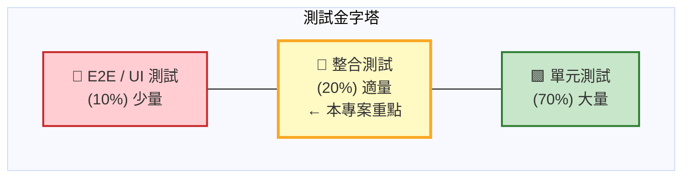
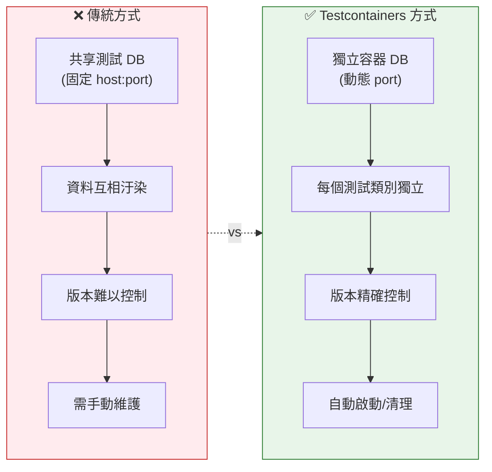
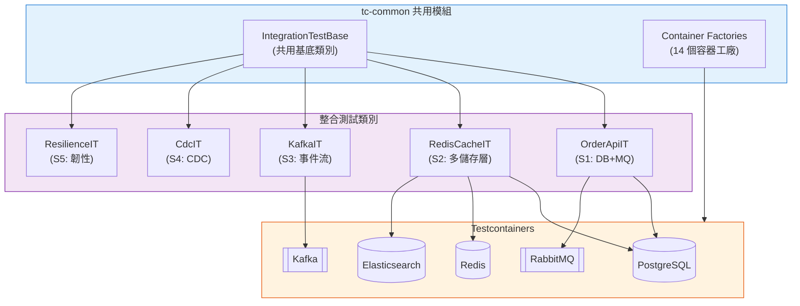
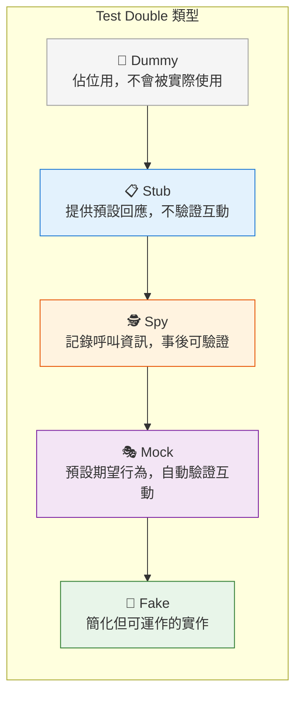
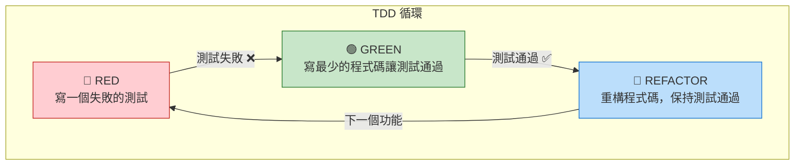
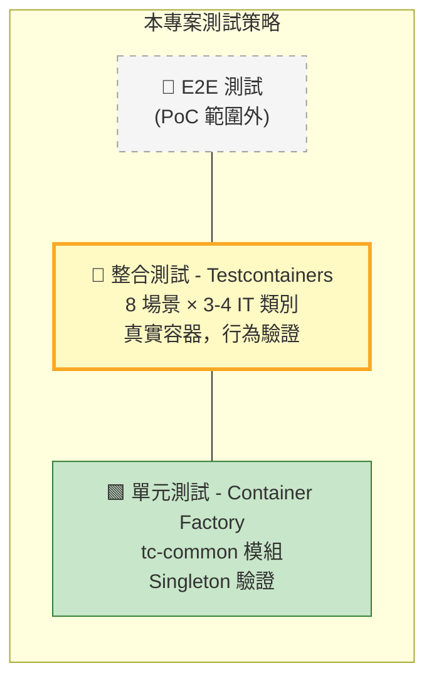
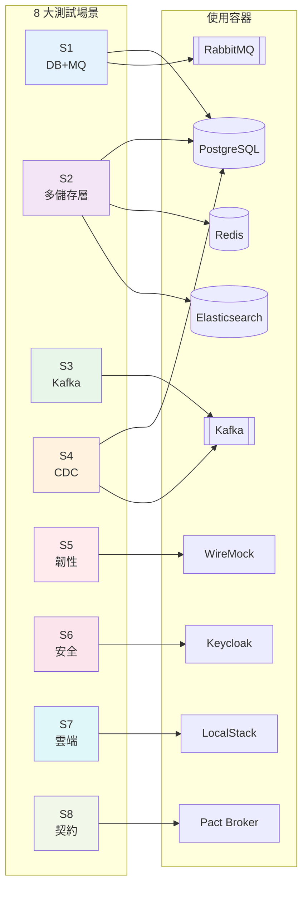

# Testcontainers Integration Testing PoC

企業級金融系統整合測試解決方案，使用 Testcontainers 框架實現環境隔離的自動化測試。

---

## 軟體測試理論與實踐指南

本章節提供完整的軟體測試理論教學，幫助讀者建立扎實的測試基礎知識，並理解本專案如何應用這些概念。

### 1. 測試金字塔（Test Pyramid）

測試金字塔是 Mike Cohn 提出的經典測試策略模型，指導我們如何分配不同類型測試的比例：



**金字塔各層特點：**
- **E2E 測試**：驗證完整業務流程，執行慢、維護成本高
- **整合測試**：驗證元件間互動，本專案 Testcontainers 重點
- **單元測試**：驗證單一函式/方法，執行快、易維護

**各層級特性比較：**

| 層級 | 執行速度 | 維護成本 | 測試範圍 | 建議比例 |
|------|----------|----------|----------|----------|
| 單元測試 | 毫秒級 | 低 | 單一函式 | 70% |
| 整合測試 | 秒級 | 中 | 多元件互動 | 20% |
| E2E 測試 | 分鐘級 | 高 | 完整流程 | 10% |

### 2. 單元測試（Unit Testing）

#### 2.1 定義與目的

單元測試是針對程式碼最小可測試單元（通常是一個方法或函式）進行的測試，目的是：

- **驗證邏輯正確性**：確保每個方法在各種輸入下都能產生預期輸出
- **快速回饋**：執行速度快，開發過程中可頻繁執行
- **文件化行為**：測試案例即程式碼行為的活文件
- **安全重構**：有測試保護的程式碼可以安心重構

#### 2.2 單元測試的 FIRST 原則

```
F - Fast（快速）：單元測試必須執行快速，通常毫秒級完成
I - Independent（獨立）：測試之間不應有相依性
R - Repeatable（可重複）：在任何環境執行都應得到相同結果
S - Self-Validating（自我驗證）：測試結果必須是明確的通過或失敗
T - Timely（及時）：測試應該在實作之前或同時撰寫（TDD）
```

#### 2.3 測試案例結構：AAA 模式

```java
@Test
void shouldCalculateOrderTotal() {
    // Arrange（準備）：設定測試前置條件
    Order order = new Order();
    order.addItem(new Item("Widget", 10.00, 2));
    order.addItem(new Item("Gadget", 25.00, 1));

    // Act（執行）：執行待測方法
    BigDecimal total = order.calculateTotal();

    // Assert（斷言）：驗證結果
    assertThat(total).isEqualTo(new BigDecimal("45.00"));
}
```

#### 2.4 本專案單元測試範例

```java
// tc-common 模組中的 Container Factory 測試
@Test
void getInstance_shouldReturnSameInstance() {
    // Arrange - 無需準備，測試靜態工廠方法

    // Act
    PostgreSQLContainer<?> first = PostgresContainerFactory.getInstance();
    PostgreSQLContainer<?> second = PostgresContainerFactory.getInstance();

    // Assert - 驗證單例模式
    assertSame(first, second, "Should return the same singleton instance");
}
```

### 3. 整合測試（Integration Testing）

#### 3.1 定義與目的

整合測試驗證多個元件或系統之間的互動是否正確運作，包括：

- **資料庫整合**：驗證 ORM 映射、SQL 查詢、交易管理
- **訊息佇列整合**：驗證事件發佈、消費、訊息格式
- **外部服務整合**：驗證 HTTP 呼叫、API 契約
- **快取整合**：驗證快取讀寫、失效策略

#### 3.2 傳統整合測試的痛點

```
問題 1：共享測試環境
├── 資料汙染：多人/多測試共用導致資料互相干擾
├── 環境爭用：測試排隊等待環境釋放
└── 狀態不一致：環境狀態難以預測

問題 2：環境設定複雜
├── 版本不符：開發機與 CI 環境版本不同
├── 設定繁瑣：每位開發者需手動設定本機環境
└── 啟動緩慢：完整環境啟動耗時數分鐘

問題 3：測試不穩定（Flaky Tests）
├── 網路問題：外部服務不穩定
├── 時序問題：非同步操作競態條件
└── 資源競爭：測試間資源衝突
```

#### 3.3 Testcontainers 解決方案

Testcontainers 透過 Docker 容器提供輕量級、一次性的測試基礎設施：



#### 3.4 本專案整合測試架構



### 4. 回歸測試（Regression Testing）

#### 4.1 定義與目的

回歸測試確保新的程式碼變更不會破壞既有功能：

- **功能回歸**：確保既有功能在變更後仍正常運作
- **效能回歸**：確保效能指標沒有下降
- **相容性回歸**：確保與依賴系統的相容性

#### 4.2 回歸測試策略

```
完整回歸（Full Regression）
├── 執行所有測試套件
├── 適用於：主要版本發布、重大重構
└── 本專案命令：./gradlew test

選擇性回歸（Selective Regression）
├── 只執行受影響模組的測試
├── 適用於：日常開發、小範圍變更
└── 本專案命令：./gradlew :scenario-s1-core:test

風險導向回歸（Risk-based Regression）
├── 優先執行高風險區域的測試
├── 適用於：時間受限的發布週期
└── 本專案：依場景優先級 P1 > P2 > P3 執行
```

#### 4.3 本專案 CI 自動化回歸

```yaml
# GitHub Actions 會依據變更檔案自動觸發對應模組測試
on:
  push:
    paths:
      - 'scenario-s1-core/**'  # 變更 S1 → 只測 S1
      - 'tc-common/**'          # 變更共用 → 測全部
```

### 5. Test Double（測試替身）

Test Double 是測試中用來替代真實依賴的物件，由 Gerard Meszaros 在《xUnit Test Patterns》中定義。

#### 5.1 五種 Test Double 類型



| 類型 | 用途 | 範例 |
|------|------|------|
| **Dummy** | 佔位用，不會被實際使用 | 填充方法參數的空物件 |
| **Stub** | 提供預設回應，不驗證互動 | 固定回傳成功的信用檢查服務 |
| **Spy** | 記錄呼叫資訊，事後可驗證 | 記錄郵件發送次數的郵件服務 |
| **Mock** | 預設期望行為，自動驗證互動 | 預期被呼叫一次的支付服務 |
| **Fake** | 簡化但可運作的實作 | 記憶體資料庫替代真實資料庫 |

#### 5.2 各類型詳細說明與範例

**Dummy（虛設物件）**

```java
// Dummy：只是填充參數，不會被使用
@Test
void shouldCreateOrderWithoutNotification() {
    NotificationService dummyNotifier = null; // 或空實作
    OrderService service = new OrderService(repository, dummyNotifier);

    Order order = service.createOrder(request);
    assertThat(order).isNotNull();
}
```

**Stub（存根）**

```java
// Stub：固定回傳值，不驗證互動
@Test
void shouldApproveOrderWhenCreditCheckPasses() {
    // Stub 固定回傳信用檢查通過
    CreditCheckService stub = customerId -> new CreditResult(true, 750);

    OrderService service = new OrderService(repository, stub);
    Order order = service.createOrder(highValueRequest);

    assertThat(order.getStatus()).isEqualTo(APPROVED);
}
```

**Spy（間諜）**

```java
// Spy：記錄互動，事後驗證
@Test
void shouldSendEmailOnOrderConfirmation() {
    SpyEmailService spy = new SpyEmailService();
    OrderService service = new OrderService(repository, spy);

    service.confirmOrder(orderId);

    // 事後驗證 Spy 記錄的資訊
    assertThat(spy.getSentEmails()).hasSize(1);
    assertThat(spy.getSentEmails().get(0).getSubject())
        .contains("Order Confirmed");
}
```

**Mock（模擬物件）**

```java
// Mock：預設期望，自動驗證
@Test
void shouldCallPaymentServiceOnce() {
    PaymentService mock = mock(PaymentService.class);
    when(mock.charge(any())).thenReturn(PaymentResult.success());

    OrderService service = new OrderService(repository, mock);
    service.processPayment(order);

    // 驗證 mock 被呼叫一次
    verify(mock, times(1)).charge(any());
}
```

**Fake（偽造物件）**

```java
// Fake：簡化但可運作的實作
public class InMemoryOrderRepository implements OrderRepository {
    private Map<UUID, Order> store = new HashMap<>();

    @Override
    public Order save(Order order) {
        store.put(order.getId(), order);
        return order;
    }

    @Override
    public Optional<Order> findById(UUID id) {
        return Optional.ofNullable(store.get(id));
    }
}

@Test
void shouldPersistOrder() {
    OrderRepository fake = new InMemoryOrderRepository();
    OrderService service = new OrderService(fake);

    Order saved = service.createOrder(request);

    assertThat(fake.findById(saved.getId())).isPresent();
}
```

#### 5.3 本專案 Test Double 應用

| 場景 | Test Double 類型 | 實作方式 |
|------|------------------|----------|
| S1 RabbitMQ | Fake (Container) | Testcontainers RabbitMQ |
| S2 Redis | Fake (Container) | Testcontainers Redis |
| S5 外部 API | Mock | WireMock Container |
| S5 網路故障 | Fake + Spy | Toxiproxy Container |
| S6 OAuth | Fake (Container) | Keycloak Container |
| S7 AWS | Fake (Container) | LocalStack Container |

### 6. TDD（測試驅動開發）

#### 6.1 Red-Green-Refactor 循環



#### 6.2 本專案 TDD 實踐

本專案 **強制採用 TDD**（參見 Constitution Principle I）：

```
tasks.md 任務結構：

Phase 3: S1 基礎整合場景
├── Tests (TDD - 先寫測試) ⚠️
│   ├── T036 撰寫 OrderRepositoryIT
│   ├── T037 撰寫 OrderMessagingIT
│   └── T038 撰寫 OrderApiIT
│
└── Implementation (後寫實作)
    ├── T039 建立 S1Application
    ├── T040 建立 OrderStatus enum
    └── ... 其他實作
```

### 7. BDD（行為驅動開發）

#### 7.1 Given-When-Then 格式

```gherkin
Feature: 訂單處理

  Scenario: 成功建立訂單
    Given 系統已啟動測試容器
    When 透過 API 建立訂單
    Then 訂單成功儲存至資料庫並回傳成功狀態

  Scenario: 訂單事件消費
    Given 訂單已成功儲存
    When 系統發佈訂單建立事件
    Then 消費者接收事件並更新訂單狀態為已確認
```

#### 7.2 本專案 BDD 測試範例

```java
/**
 * Integration tests for Order API.
 * Validates US2: 訂單處理端對端測試
 *
 * Given 系統已啟動測試容器
 * When 透過 API 建立訂單
 * Then 訂單成功儲存至資料庫並回傳成功狀態
 */
@Test
void shouldCreateOrder() {
    // Given - 系統已啟動測試容器（由 @Import(S1TestApplication.class) 處理）
    CreateOrderRequest request = new CreateOrderRequest(
        "金控客戶", "信用卡服務", 2, new BigDecimal("25000.00")
    );

    // When - 透過 API 建立訂單
    // Then - 訂單成功儲存至資料庫並回傳成功狀態
    given()
        .contentType(ContentType.JSON)
        .body(request)
    .when()
        .post()
    .then()
        .statusCode(201)
        .body("id", notNullValue())
        .body("status", equalTo("PENDING"));
}
```

### 8. 測試覆蓋率

#### 8.1 覆蓋率指標類型

```
行覆蓋率（Line Coverage）
├── 定義：被執行的程式碼行數 / 總行數
├── 優點：直觀易懂
└── 缺點：不保證所有路徑被測試

分支覆蓋率（Branch Coverage）
├── 定義：被執行的分支數 / 總分支數
├── 優點：確保條件判斷都被測試
└── 缺點：仍可能遺漏邊界條件

方法覆蓋率（Method Coverage）
├── 定義：被呼叫的方法數 / 總方法數
└── 適用：快速評估測試廣度

變異測試（Mutation Testing）
├── 定義：故意修改程式碼，檢查測試是否能發現
├── 優點：評估測試品質而非數量
└── 工具：PIT (PITest)
```

#### 8.2 本專案覆蓋率目標

| 指標 | 目標值 | 檢查方式 |
|------|--------|----------|
| 每模組行覆蓋率 | ≥ 80% | `./gradlew :module:jacocoTestReport` |
| 整合覆蓋率 | ≥ 80% | `./gradlew jacocoAggregatedReport` |
| 契約測試覆蓋 | ≥ 90% API | S8 Pact 測試 |

### 9. 測試反模式（Anti-patterns）

#### 9.1 常見反模式與解決方案

```
❌ 反模式 1：測試過於依賴實作細節
   問題：程式碼小改動就導致測試失敗
   解法：測試行為（What）而非實作（How）

❌ 反模式 2：測試之間有順序依賴
   問題：單獨執行某測試會失敗
   解法：每個測試必須能獨立執行

❌ 反模式 3：Flaky Tests（不穩定測試）
   問題：相同程式碼，測試結果不一致
   解法：使用 Awaitility 處理非同步、Testcontainers 確保環境一致

❌ 反模式 4：測試程式碼品質低落
   問題：測試難以理解、維護
   解法：測試程式碼也要 Code Review

❌ 反模式 5：過度 Mock
   問題：Mock 太多導致測試脫離現實
   解法：使用 Testcontainers 進行真實整合測試
```

### 10. 本專案測試策略總結



#### 本專案各場景測試對照表



| 測試類型 | 本專案對應 | 工具 |
|----------|------------|------|
| 單元測試 | Container Factory Tests | JUnit 5 |
| 整合測試 | *IT.java | Testcontainers + Spring Boot Test |
| 契約測試 | S8 Pact Tests | Pact JUnit 5 |
| 韌性測試 | S5 Circuit Breaker | WireMock + Toxiproxy |
| 安全測試 | S6 OAuth Tests | Keycloak Container |

---

## 專案概述

本專案透過 Gradle Monorepo Multi-Module 架構，建立涵蓋 8 大場景的標準化整合測試方案，解決傳統整合測試面臨的環境依賴、資料汙染、CI 瓶頸等問題。

## 先決條件

- Java 21+
- Docker Engine 20.10+
- Gradle 8.x
- 本機至少 8GB RAM（執行完整測試套件）

## 快速開始

```bash
# 執行單一場景測試
./gradlew :scenario-s1-core:test

# 執行所有測試
./gradlew test
```

## CI 環境 Docker 存取策略

Testcontainers 在 CI 環境中需要存取 Docker daemon，本專案支援兩種策略，系統會依據 CI 平台自動選擇最適合的方式。

### 方法一：Docker Socket 掛載（推薦）

將主機的 Docker socket 掛載至 CI runner 容器內，讓 Testcontainers 直接與主機 Docker daemon 通訊。

**優點：**
- 效能較佳，無額外虛擬化開銷
- 設定較簡單
- Testcontainers 官方推薦方式

**缺點：**
- 需要適當的安全控管
- CI runner 容器需要存取主機 Docker socket 的權限

**GitHub Actions 設定範例：**

```yaml
jobs:
  test:
    runs-on: ubuntu-latest
    steps:
      - uses: actions/checkout@v4

      - name: Set up JDK 21
        uses: actions/setup-java@v4
        with:
          java-version: '21'
          distribution: 'temurin'

      - name: Run integration tests
        run: ./gradlew test
```

**GitLab CI 設定範例：**

```yaml
integration-test:
  image: eclipse-temurin:21-jdk
  services:
    - docker:dind
  variables:
    DOCKER_HOST: tcp://docker:2375
  script:
    - ./gradlew test
```

**Jenkins 設定範例（Docker socket 掛載）：**

```groovy
pipeline {
    agent {
        docker {
            image 'eclipse-temurin:21-jdk'
            args '-v /var/run/docker.sock:/var/run/docker.sock'
        }
    }
    stages {
        stage('Test') {
            steps {
                sh './gradlew test'
            }
        }
    }
}
```

### 方法二：Docker-in-Docker (DinD)

在 CI runner 容器內啟動一個獨立的 Docker daemon，實現完全隔離的 Docker 環境。

**優點：**
- 完全隔離，不影響主機 Docker 環境
- 安全性較高
- 適合多租戶 CI 環境

**缺點：**
- 效能較低，有額外虛擬化開銷
- 設定較複雜
- 需要 privileged 模式運行

**GitHub Actions 設定範例（使用 DinD service）：**

```yaml
jobs:
  test:
    runs-on: ubuntu-latest
    services:
      dind:
        image: docker:dind
        options: --privileged
        ports:
          - 2375:2375
    env:
      DOCKER_HOST: tcp://localhost:2375
      DOCKER_TLS_CERTDIR: ""
    steps:
      - uses: actions/checkout@v4

      - name: Set up JDK 21
        uses: actions/setup-java@v4
        with:
          java-version: '21'
          distribution: 'temurin'

      - name: Wait for Docker
        run: |
          until docker info; do
            echo "Waiting for Docker..."
            sleep 1
          done

      - name: Run integration tests
        run: ./gradlew test
```

**GitLab CI 設定範例（DinD）：**

```yaml
integration-test:
  image: eclipse-temurin:21-jdk
  services:
    - name: docker:dind
      command: ["--tls=false"]
  variables:
    DOCKER_HOST: tcp://docker:2375
    DOCKER_TLS_CERTDIR: ""
  script:
    - ./gradlew test
```

### 自動偵測機制

本專案的 `tc-common` 模組會自動偵測 CI 環境並選擇適當的 Docker 存取策略：

1. 檢查 `DOCKER_HOST` 環境變數是否已設定
2. 檢查 `/var/run/docker.sock` 是否存在且可存取
3. 嘗試連線至 `tcp://localhost:2375`（DinD 預設端口）
4. 根據偵測結果自動配置 Testcontainers

開發人員無需手動配置，系統會自動處理。

## 容器映像快取策略

為確保 CI 測試的穩定性與效能，建議採用以下映像快取策略：

### 策略一：內部 Registry 快取（正式環境推薦）

在企業內部架設容器映像 registry（如 Harbor、Nexus、Artifactory），定期從公開 registry 同步所需映像。

**優點：**
- 避免外部 registry 限流（Docker Hub rate limit）或故障影響
- 確保映像版本一致性
- 符合企業安全政策

**設定方式：**

```properties
# testcontainers.properties
docker.registry=harbor.internal.company.com
```

```yaml
# GitHub Actions 範例
env:
  TESTCONTAINERS_HUB_IMAGE_NAME_PREFIX: harbor.internal.company.com/
```

### 策略二：CI Runner 本地快取（建議選項）

利用 CI runner 的本地 Docker 映像快取，避免重複拉取。適合沒有內部 registry 的團隊快速導入。

**優點：**
- 設定簡單，無需額外基礎設施
- 後續執行速度快
- 適合中小型團隊

**缺點：**
- 首次執行或快取失效時較慢
- 需要足夠的磁碟空間

**GitHub Actions 設定範例：**

```yaml
jobs:
  test:
    runs-on: ubuntu-latest
    steps:
      - uses: actions/checkout@v4

      - name: Set up JDK 21
        uses: actions/setup-java@v4
        with:
          java-version: '21'
          distribution: 'temurin'

      # 預先拉取常用映像以利用 runner 快取
      - name: Pre-pull container images
        run: |
          docker pull postgres:16-alpine
          docker pull rabbitmq:3.13-management-alpine
          docker pull redis:7-alpine

      - name: Run integration tests
        run: ./gradlew test
```

**GitLab CI 設定範例（使用 cache）：**

```yaml
variables:
  DOCKER_DRIVER: overlay2

integration-test:
  image: eclipse-temurin:21-jdk
  services:
    - docker:dind
  before_script:
    # 預先拉取映像
    - docker pull postgres:16-alpine
    - docker pull rabbitmq:3.13-management-alpine
  script:
    - ./gradlew test
  cache:
    key: docker-images
    paths:
      - /var/lib/docker
```

**Jenkins 設定範例（持久化 Docker 層）：**

```groovy
pipeline {
    agent {
        docker {
            image 'eclipse-temurin:21-jdk'
            args '''
                -v /var/run/docker.sock:/var/run/docker.sock
                -v docker-cache:/var/lib/docker
            '''
        }
    }
    stages {
        stage('Pre-pull Images') {
            steps {
                sh '''
                    docker pull postgres:16-alpine
                    docker pull rabbitmq:3.13-management-alpine
                    docker pull redis:7-alpine
                '''
            }
        }
        stage('Test') {
            steps {
                sh './gradlew test'
            }
        }
    }
}
```

### 本專案使用的容器映像

| 場景 | 映像 | 用途 |
|------|------|------|
| S1, S2, S4, S6 | `postgres:16-alpine` | 主資料庫 |
| S1 | `rabbitmq:3.13-management-alpine` | 訊息佇列 |
| S2 | `redis:7-alpine` | 快取 |
| S2 | `elasticsearch:8.x` | 搜尋索引 |
| S3, S4 | `confluentinc/cp-kafka` | 事件串流 |
| S3 | `confluentinc/cp-schema-registry` | Schema 管理 |
| S4 | `debezium/connect` | CDC 連接器 |
| S5 | `wiremock/wiremock` | API Mock |
| S5 | `shopify/toxiproxy` | 故障注入 |
| S6 | `quay.io/keycloak/keycloak` | 身份驗證 |
| S6 | `hashicorp/vault` | 密鑰管理 |
| S7 | `localstack/localstack` | AWS 模擬 |
| S7 | `mcr.microsoft.com/azure-storage/azurite` | Azure 模擬 |
| S8 | `pactfoundation/pact-broker` | 契約管理 |

## 專案結構

```
testcontainers-poc/
├── tc-common/                    # 共用測試基礎設施
├── scenario-s1-core/             # Phase 1: DB + MQ + API
├── scenario-s2-multistore/       # Phase 1: PostgreSQL + Redis + ES
├── scenario-s3-kafka/            # Phase 2: Kafka + Schema Registry
├── scenario-s4-cdc/              # Phase 2: Debezium CDC
├── scenario-s5-resilience/       # Phase 2: WireMock + Toxiproxy
├── scenario-s6-security/         # Phase 3: Keycloak + Vault
├── scenario-s7-cloud/            # Phase 3: LocalStack + Azurite
└── scenario-s8-contract/         # Phase 3: Pact Broker
```

## 相關文件

- [功能規格](specs/001-testcontainers-poc/spec.md)
- [PRD](PRD.md)

## 授權

MIT License
