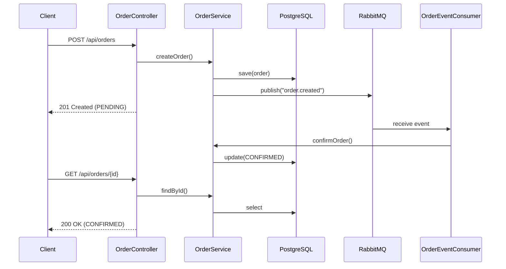

# Scenario S1: Core Integration (DB + MQ + API)

## 概述

S1 場景展示 Testcontainers 管理 PostgreSQL 資料庫與 RabbitMQ 訊息佇列的基礎整合測試能力。

## 涵蓋的使用者故事

- **US1**: 本機執行單一場景測試
- **US2**: 訂單處理端對端測試

## 技術元件

| 元件 | 容器映像 | 用途 |
|------|----------|------|
| PostgreSQL | postgres:16-alpine | 訂單資料持久化 |
| RabbitMQ | rabbitmq:3.13-management-alpine | 事件發佈與消費 |

## 執行測試

```bash
# 執行 S1 所有測試
./gradlew :scenario-s1-core:test

# 執行特定測試類別
./gradlew :scenario-s1-core:test --tests "com.example.s1.OrderApiIT"

# 帶詳細輸出
./gradlew :scenario-s1-core:test --info
```

## 測試類別

| 測試類別 | 驗證內容 |
|----------|----------|
| `OrderRepositoryIT` | 資料庫 CRUD 操作、狀態查詢 |
| `OrderMessagingIT` | 事件發佈、消費者處理、狀態更新 |
| `OrderApiIT` | REST API 端點、HTTP 狀態碼、回應格式 |

## 架構

```
scenario-s1-core/
├── src/main/java/com/example/s1/
│   ├── S1Application.java          # Spring Boot 應用程式
│   ├── domain/
│   │   ├── Order.java              # 訂單實體 (Aggregate Root)
│   │   └── OrderStatus.java        # 訂單狀態 (Value Object)
│   ├── repository/
│   │   └── OrderRepository.java    # 資料存取介面 (Port)
│   ├── service/
│   │   └── OrderService.java       # 應用服務
│   ├── messaging/
│   │   ├── OrderEventPublisher.java # 事件發佈者 (Adapter)
│   │   └── OrderEventConsumer.java  # 事件消費者
│   ├── web/
│   │   └── OrderController.java    # REST 控制器 (Adapter)
│   └── config/
│       └── RabbitMqConfig.java     # RabbitMQ 配置
├── src/main/resources/
│   ├── application.yml
│   └── db/migration/
│       └── V1__create_orders_table.sql
└── src/test/java/com/example/s1/
    ├── S1TestApplication.java      # 測試配置 (@ServiceConnection)
    ├── OrderRepositoryIT.java
    ├── OrderMessagingIT.java
    └── OrderApiIT.java
```

## 系統架構


## 端對端流程



## 驗收標準

- ✅ 容器自動啟動（無需手動設定）
- ✅ 測試完成後容器自動清理
- ✅ 資料庫 Schema 自動遷移（Flyway）
- ✅ 測試之間資料隔離
- ✅ 事件發佈與消費正確處理
