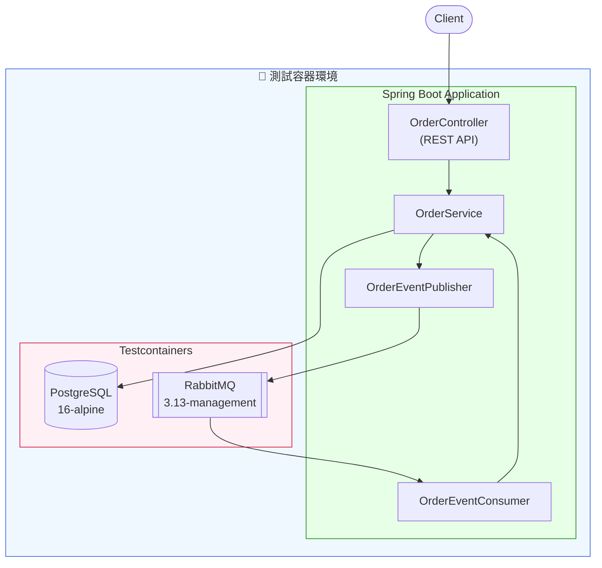
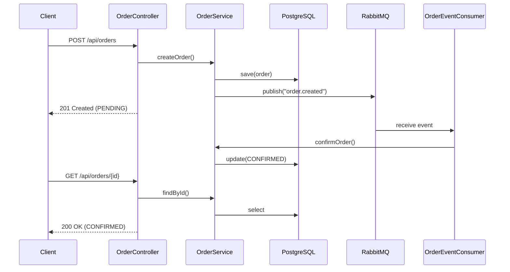

# Scenario S1: Core Integration (DB + MQ + API)

## 學習目標

完成本場景後，您將學會：
- 使用 Testcontainers 管理 PostgreSQL 和 RabbitMQ 容器
- 實作端對端整合測試（Repository → Service → Controller → Messaging）
- 使用 `@ServiceConnection` 自動配置容器連線
- 使用 Flyway 管理資料庫 Schema 遷移
- 驗證非同步訊息處理流程

## 環境需求

- Java 21+
- Docker Desktop（確保已啟動）
- Gradle 8.x

## 概述

S1 場景展示 Testcontainers 管理 PostgreSQL 資料庫與 RabbitMQ 訊息佇列的基礎整合測試能力。這是最基本的整合測試場景，涵蓋了資料持久化、REST API 和非同步訊息處理。

## 涵蓋的使用者故事

- **US1**: 本機執行單一場景測試
- **US2**: 訂單處理端對端測試

## 技術元件

| 元件 | 容器映像 | 用途 |
|------|----------|------|
| PostgreSQL | postgres:16-alpine | 訂單資料持久化 |
| RabbitMQ | rabbitmq:3.13-management-alpine | 事件發佈與消費 |

## 核心概念

### 1. @ServiceConnection 自動配置

Spring Boot 3.1+ 提供的 `@ServiceConnection` 註解可以自動配置容器連線：

```java
@TestConfiguration(proxyBeanMethods = false)
public class S1TestApplication {

    @Bean
    @ServiceConnection
    PostgreSQLContainer<?> postgresContainer() {
        return PostgresContainerFactory.getInstance();
    }

    @Bean
    @ServiceConnection
    RabbitMQContainer rabbitMqContainer() {
        return RabbitMqContainerFactory.getInstance();
    }
}
```

這會自動設定 `spring.datasource.*` 和 `spring.rabbitmq.*` 屬性。

### 2. Flyway Schema 遷移

資料庫結構由 Flyway 管理，遷移腳本位於 `src/main/resources/db/migration/`：

```sql
-- V1__create_orders_table.sql
CREATE TABLE orders (
    id UUID PRIMARY KEY DEFAULT gen_random_uuid(),
    customer_name VARCHAR(255) NOT NULL,
    amount DECIMAL(10, 2) NOT NULL,
    status VARCHAR(50) NOT NULL,
    created_at TIMESTAMP DEFAULT CURRENT_TIMESTAMP
);
```

### 3. 非同步訊息處理

訂單建立時發佈事件，消費者接收後更新狀態：

```java
// Publisher
rabbitTemplate.convertAndSend(exchangeName, routingKey, orderEvent);

// Consumer
@RabbitListener(queues = "${app.rabbitmq.queue}")
public void handleOrderCreated(OrderCreatedEvent event) {
    orderService.confirmOrder(event.orderId());
}
```

## 教學步驟

### 步驟 1：理解專案結構

```
scenario-s1-core/
├── src/main/java/com/example/s1/
│   ├── S1Application.java          # Spring Boot 應用程式
│   ├── domain/
│   │   ├── Order.java              # 訂單實體 (Aggregate Root)
│   │   └── OrderStatus.java        # 訂單狀態 (Value Object)
│   ├── repository/
│   │   └── OrderRepository.java    # 資料存取介面 (Port)
│   ├── service/
│   │   └── OrderService.java       # 應用服務
│   ├── messaging/
│   │   ├── OrderEventPublisher.java # 事件發佈者 (Adapter)
│   │   └── OrderEventConsumer.java  # 事件消費者
│   ├── web/
│   │   └── OrderController.java    # REST 控制器 (Adapter)
│   └── config/
│       └── RabbitMqConfig.java     # RabbitMQ 配置
├── src/main/resources/
│   ├── application.yml
│   └── db/migration/
│       └── V1__create_orders_table.sql
└── src/test/java/com/example/s1/
    ├── S1TestApplication.java      # 測試配置 (@ServiceConnection)
    ├── OrderRepositoryIT.java
    ├── OrderMessagingIT.java
    └── OrderApiIT.java
```

### 步驟 2：執行測試

```bash
# 執行 S1 所有測試
./gradlew :scenario-s1-core:test

# 執行特定測試類別
./gradlew :scenario-s1-core:test --tests "com.example.s1.OrderApiIT"

# 帶詳細輸出
./gradlew :scenario-s1-core:test --info
```

### 步驟 3：觀察測試結果

測試報告位於 `build/reports/tests/test/index.html`

## 測試類別說明

| 測試類別 | 驗證內容 | 關鍵測試案例 |
|----------|----------|--------------|
| `OrderRepositoryIT` | 資料庫 CRUD 操作、狀態查詢 | `shouldSaveAndFindOrder`, `shouldFindOrdersByStatus` |
| `OrderMessagingIT` | 事件發佈、消費者處理、狀態更新 | `shouldPublishOrderCreatedEvent`, `shouldHandleMultipleOrderEvents` |
| `OrderApiIT` | REST API 端點、HTTP 狀態碼、回應格式 | `shouldCreateOrder`, `shouldReturn404ForNonExistentOrder` |
| `SchemaMigrationIT` | Flyway 遷移、Schema 結構 | `shouldExecuteAllMigrationsSuccessfully` |

## 系統架構



## 端對端流程



## 程式碼範例

### Repository 測試

```java
@Test
void shouldSaveAndFindOrder() {
    // Given
    Order order = Order.create("John Doe", new BigDecimal("99.99"));

    // When
    Order saved = orderRepository.save(order);
    Optional<Order> found = orderRepository.findById(saved.getId());

    // Then
    assertThat(found).isPresent();
    assertThat(found.get().getCustomerName()).isEqualTo("John Doe");
    assertThat(found.get().getStatus()).isEqualTo(OrderStatus.PENDING);
}
```

### API 測試

```java
@Test
void shouldCreateOrder() {
    // Given
    var request = new CreateOrderRequest("Jane Doe", new BigDecimal("149.99"));

    // When
    var response = restTemplate.postForEntity("/api/orders", request, OrderResponse.class);

    // Then
    assertThat(response.getStatusCode()).isEqualTo(HttpStatus.CREATED);
    assertThat(response.getBody().customerName()).isEqualTo("Jane Doe");
}
```

### 訊息處理測試

```java
@Test
void shouldPublishOrderCreatedEvent() {
    // Given
    Order order = orderService.createOrder("Test Customer", new BigDecimal("50.00"));

    // When - wait for async processing
    await().atMost(5, TimeUnit.SECONDS)
           .until(() -> orderService.findById(order.getId())
                                    .map(Order::getStatus)
                                    .orElse(null) == OrderStatus.CONFIRMED);

    // Then
    Order confirmed = orderService.findById(order.getId()).orElseThrow();
    assertThat(confirmed.getStatus()).isEqualTo(OrderStatus.CONFIRMED);
}
```

## 常見問題

### Q1: 容器啟動失敗
**問題**: Docker 未啟動或權限不足
**解決**: 確保 Docker Desktop 已啟動，並檢查 Docker daemon 是否正常運行

### Q2: 測試資料污染
**問題**: 測試之間資料互相影響
**解決**: 使用 `@Transactional` 或在 `@BeforeEach` 中清理資料

### Q3: 非同步測試不穩定
**問題**: 訊息處理時間不確定導致測試失敗
**解決**: 使用 Awaitility 等待非同步操作完成，避免固定 `Thread.sleep()`

## 驗收標準

- ✅ 容器自動啟動（無需手動設定）
- ✅ 測試完成後容器自動清理
- ✅ 資料庫 Schema 自動遷移（Flyway）
- ✅ 測試之間資料隔離
- ✅ 事件發佈與消費正確處理

## 延伸學習

- [S2-MultiStore](../scenario-s2-multistore/): 多資料庫整合（PostgreSQL + Redis + Elasticsearch）
- [S3-Kafka](../scenario-s3-kafka/): Kafka 訊息與 Schema Registry
- [Testcontainers 官方文件](https://testcontainers.com/)
