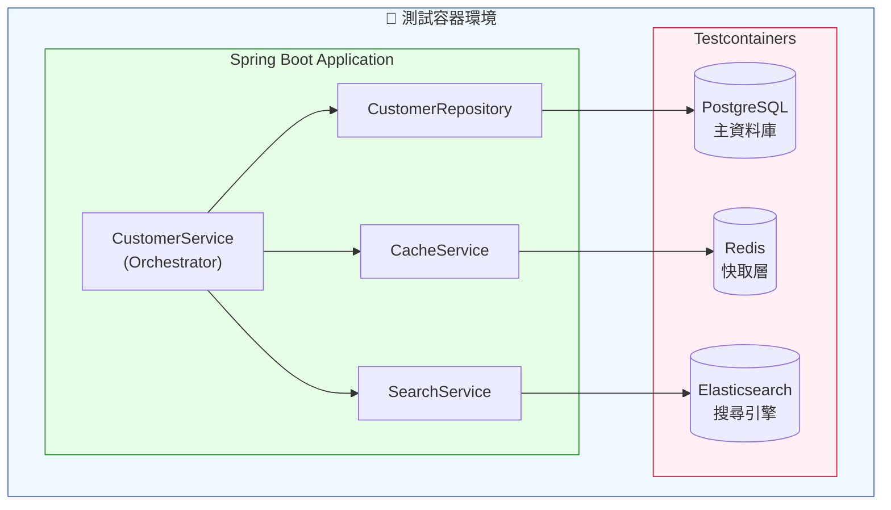
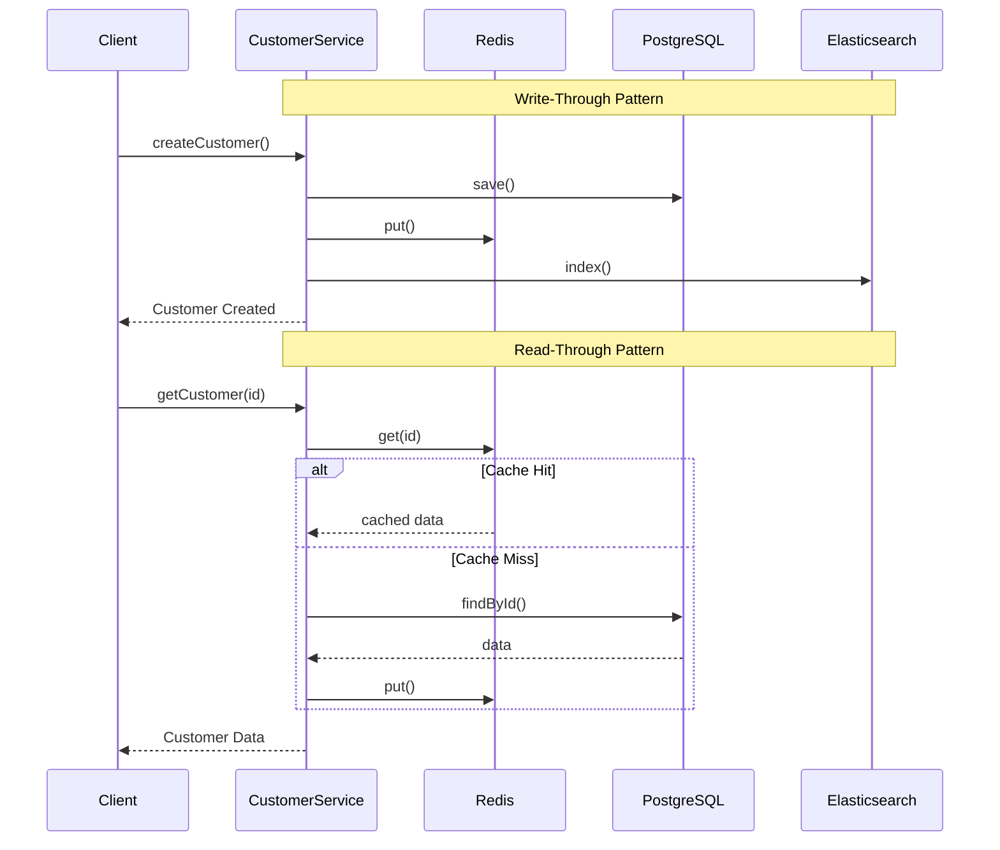

# Scenario S2: 多資料存儲整合測試

## 學習目標

完成本場景後，您將學會：
- 整合多種資料存儲系統（PostgreSQL、Redis、Elasticsearch）
- 實作 Write-Through 和 Read-Through 快取模式
- 測試跨資料存儲的資料一致性
- 使用 `@DynamicPropertySource` 動態配置容器連線
- 驗證搜尋索引的即時同步

## 環境需求

- Java 21+
- Docker Desktop（需要足夠記憶體，建議 8GB+）
- Gradle 8.x

## 概述

S2 場景展示如何使用 Testcontainers 同時管理多個資料存儲系統：
- **PostgreSQL** - 主要資料庫（單一真實來源）
- **Redis** - 快取層（提升讀取效能）
- **Elasticsearch** - 搜尋引擎（全文檢索）

這是實際生產環境常見的架構模式，需要確保資料在三個系統間保持一致。

## 技術元件

| 元件 | 容器映像 | 用途 |
|------|----------|------|
| PostgreSQL | postgres:16-alpine | 客戶資料持久化 |
| Redis | redis:7-alpine | 快取層 |
| Elasticsearch | elasticsearch:8.12.0 | 搜尋索引 |

## 核心概念

### 1. Write-Through 快取模式

寫入時同時更新資料庫和快取：

```java
public Customer createCustomer(Customer customer) {
    // 1. 寫入資料庫
    Customer saved = customerRepository.save(customer);

    // 2. 更新快取
    cacheService.put(saved.getId(), saved);

    // 3. 更新搜尋索引
    searchService.index(saved);

    return saved;
}
```

### 2. Read-Through 快取模式

讀取時先查快取，未命中再查資料庫：

```java
public Optional<Customer> getCustomer(UUID id) {
    // 1. 查詢快取
    Optional<Customer> cached = cacheService.get(id);
    if (cached.isPresent()) {
        return cached; // Cache Hit
    }

    // 2. Cache Miss - 查詢資料庫
    Optional<Customer> fromDb = customerRepository.findById(id);

    // 3. 回填快取
    fromDb.ifPresent(c -> cacheService.put(id, c));

    return fromDb;
}
```

### 3. @DynamicPropertySource 動態配置

由於 Elasticsearch 需要特殊配置，使用 `@DynamicPropertySource`：

```java
@DynamicPropertySource
static void configureProperties(DynamicPropertyRegistry registry) {
    registry.add("spring.datasource.url", POSTGRES_CONTAINER::getJdbcUrl);
    registry.add("spring.data.redis.host", REDIS_CONTAINER::getHost);
    registry.add("spring.data.redis.port", () -> REDIS_CONTAINER.getMappedPort(6379));
    registry.add("spring.elasticsearch.uris", () ->
        "http://" + ES_CONTAINER.getHost() + ":" + ES_CONTAINER.getMappedPort(9200));
}
```

## 教學步驟

### 步驟 1：理解專案結構

```
scenario-s2-multistore/
├── src/main/java/com/example/s2/
│   ├── S2Application.java           # Spring Boot 應用程式
│   ├── config/
│   │   ├── RedisConfig.java         # Redis 配置
│   │   └── ElasticsearchConfig.java # Elasticsearch 配置
│   ├── domain/
│   │   └── Customer.java            # 客戶實體
│   ├── repository/
│   │   └── CustomerRepository.java  # JPA Repository
│   └── service/
│       ├── CacheService.java        # Redis 快取服務
│       ├── SearchService.java       # Elasticsearch 搜尋服務
│       └── CustomerService.java     # 整合服務（協調三個存儲）
├── src/main/resources/
│   ├── application.yml
│   └── db/migration/
│       └── V1__create_customers_table.sql
└── src/test/java/com/example/s2/
    ├── S2IntegrationTestBase.java   # 測試基底類別（容器配置）
    ├── RedisCacheIT.java            # 快取整合測試
    ├── ElasticsearchSyncIT.java     # 搜尋同步測試
    ├── MultiStoreConsistencyIT.java # 一致性測試
    └── SchemaMigrationIT.java       # Schema 遷移測試
```

### 步驟 2：執行測試

```bash
# 執行 S2 所有測試
./gradlew :scenario-s2-multistore:test

# 執行特定測試類別
./gradlew :scenario-s2-multistore:test --tests "RedisCacheIT"
./gradlew :scenario-s2-multistore:test --tests "ElasticsearchSyncIT"
./gradlew :scenario-s2-multistore:test --tests "MultiStoreConsistencyIT"
```

### 步驟 3：觀察資料流動

啟動測試時，觀察以下流程：
1. 建立客戶 → 同時寫入 PostgreSQL、Redis、Elasticsearch
2. 查詢客戶 → 優先從 Redis 取得
3. 搜尋客戶 → 從 Elasticsearch 全文檢索
4. 刪除客戶 → 三個存儲同時清除

## 系統架構



## 資料流程



## 測試類別說明

### RedisCacheIT - 快取測試

| 測試案例 | 說明 |
|----------|------|
| `shouldPopulateCacheOnCreate` | Write-through：建立時填充快取 |
| `shouldReturnCachedDataOnHit` | Read-through：快取命中返回快取資料 |
| `shouldFetchFromDbOnCacheMiss` | Read-through：未命中時查詢資料庫 |
| `shouldEvictCacheOnDelete` | 刪除時清除快取 |
| `shouldUpdateCacheOnUpdate` | 更新時同步快取 |
| `shouldHaveTTL` | 驗證快取過期時間 |

### ElasticsearchSyncIT - 搜尋同步測試

| 測試案例 | 說明 |
|----------|------|
| `shouldIndexWithinFiveSeconds` | SC-011：5秒內完成索引 |
| `shouldUpdateIndexWithinFiveSeconds` | 更新後5秒內同步 |
| `shouldDeleteIndexWithinFiveSeconds` | 刪除後5秒內同步 |
| `shouldSearchByName` | 按姓名搜尋 |
| `shouldSearchByEmail` | 按 Email 搜尋 |
| `shouldFullTextSearch` | 全文檢索 |

### MultiStoreConsistencyIT - 一致性測試

| 測試案例 | 說明 |
|----------|------|
| `shouldMaintainConsistencyOnCreate` | 建立後三個存儲一致 |
| `shouldMaintainConsistencyOnUpdate` | 更新後三個存儲一致 |
| `shouldMaintainConsistencyOnDelete` | 刪除後三個存儲一致 |
| `cachedDataShouldMatchDatabase` | 快取與資料庫一致 |

## 程式碼範例

### 快取服務

```java
@Service
public class CacheService {

    private final RedisTemplate<String, Object> redisTemplate;
    private static final Duration TTL = Duration.ofMinutes(30);

    public void put(UUID id, Customer customer) {
        String key = "customer:" + id;
        redisTemplate.opsForValue().set(key, customer, TTL);
    }

    public Optional<Customer> get(UUID id) {
        String key = "customer:" + id;
        Customer customer = (Customer) redisTemplate.opsForValue().get(key);
        return Optional.ofNullable(customer);
    }

    public void evict(UUID id) {
        String key = "customer:" + id;
        redisTemplate.delete(key);
    }
}
```

### 一致性測試

```java
@Test
void shouldMaintainConsistencyOnCreate() {
    // Given
    Customer customer = new Customer("John Doe", "john@example.com");

    // When
    Customer saved = customerService.createCustomer(customer);

    // Then - 驗證三個存儲都有資料
    // 1. PostgreSQL
    assertThat(customerRepository.findById(saved.getId())).isPresent();

    // 2. Redis
    assertThat(cacheService.get(saved.getId())).isPresent();

    // 3. Elasticsearch (等待索引)
    await().atMost(5, TimeUnit.SECONDS)
           .until(() -> searchService.findById(saved.getId()).isPresent());
}
```

## 常見問題

### Q1: Elasticsearch 容器啟動慢
**問題**: Elasticsearch 需要較長時間啟動（30-60秒）
**解決**: 使用容器重用（`withReuse(true)`）加速後續測試

### Q2: 記憶體不足
**問題**: 同時運行三個容器需要較多記憶體
**解決**: 調整 Docker Desktop 記憶體配置（建議 8GB+）

### Q3: 搜尋同步延遲
**問題**: Elasticsearch 索引更新有短暫延遲
**解決**: 測試中使用 Awaitility 等待，並設定合理的 refresh_interval

### Q4: ElasticsearchTemplate Bean 找不到
**問題**: Spring Data Elasticsearch 自動配置失敗
**解決**: 使用 `ElasticsearchConfig` 明確定義所有必要的 Bean

## 驗收標準

- ✅ 快取命中率測試
- ✅ 搜尋索引 5 秒內同步（SC-011）
- ✅ 跨存儲資料一致性
- ✅ TTL 過期驗證
- ✅ CRUD 操作完整覆蓋

## 延伸學習

- [S1-Core](../scenario-s1-core/): 基礎整合測試
- [S4-CDC](../scenario-s4-cdc/): 使用 CDC 保持資料同步
- [Spring Data Redis 文件](https://spring.io/projects/spring-data-redis)
- [Spring Data Elasticsearch 文件](https://spring.io/projects/spring-data-elasticsearch)
