# Scenario S2: Multi-Store Integration Testing

This scenario demonstrates integration testing with multiple data stores using Testcontainers:
- **PostgreSQL** - Primary data store
- **Redis** - Cache layer
- **Elasticsearch** - Search index

## Architecture

```mermaid
flowchart TB
    subgraph Test["🧪 測試容器環境"]
        subgraph App["Spring Boot Application"]
            CS["CustomerService\n(Orchestrator)"]
            Cache["CacheService"]
            Search["SearchService"]
            Repo["CustomerRepository"]
        end

        subgraph Containers["Testcontainers"]
            PG[(PostgreSQL\n主資料庫)]
            Redis[(Redis\n快取層)]
            ES[(Elasticsearch\n搜尋引擎)]
        end
    end

    CS --> Cache
    CS --> Search
    CS --> Repo

    Repo --> PG
    Cache --> Redis
    Search --> ES

    style Test fill:#f0f8ff,stroke:#4169e1
    style App fill:#e6ffe6,stroke:#228b22
    style Containers fill:#fff0f5,stroke:#dc143c
```



### 資料流程


## Features

### Cache Patterns
- **Write-through**: Data is written to both database and cache on create/update
- **Read-through**: Cache is populated from database on cache miss
- **Cache eviction**: Cache is cleared on delete operations

### Search Synchronization
- Customer data is indexed in Elasticsearch on create/update
- Search index is updated within 5 seconds (SC-011 requirement)
- Full-text search across name, email, and address fields

### Data Consistency
- All three stores maintain consistent data
- CRUD operations update all stores atomically
- Eventual consistency verification within 5 seconds

## Project Structure

```
scenario-s2-multistore/
├── src/main/java/com/example/s2/
│   ├── S2Application.java           # Spring Boot application
│   ├── config/
│   │   ├── RedisConfig.java         # Redis configuration
│   │   └── ElasticsearchConfig.java # Elasticsearch configuration
│   ├── domain/
│   │   └── Customer.java            # Customer entity
│   ├── repository/
│   │   └── CustomerRepository.java  # JPA repository
│   └── service/
│       ├── CacheService.java        # Redis cache operations
│       ├── SearchService.java       # Elasticsearch operations
│       └── CustomerService.java     # Orchestration service
├── src/main/resources/
│   ├── application.yml              # Application configuration
│   └── db/migration/
│       └── V1__create_customers_table.sql
└── src/test/java/com/example/s2/
    ├── S2TestApplication.java       # Test configuration
    ├── RedisCacheIT.java            # Cache integration tests
    ├── ElasticsearchSyncIT.java     # Search sync tests
    └── MultiStoreConsistencyIT.java # Consistency tests
```

## Running Tests

```bash
# Run all S2 tests
./gradlew :scenario-s2-multistore:test

# Run specific test class
./gradlew :scenario-s2-multistore:test --tests "RedisCacheIT"
./gradlew :scenario-s2-multistore:test --tests "ElasticsearchSyncIT"
./gradlew :scenario-s2-multistore:test --tests "MultiStoreConsistencyIT"
```

## Test Coverage

### RedisCacheIT
- Write-through cache population on create
- Read-through cache population on cache miss
- Cache hit/miss scenarios
- Cache eviction on delete
- Cache update on customer update
- TTL verification

### ElasticsearchSyncIT
- Index creation within 5 seconds (SC-011)
- Index update within 5 seconds
- Index deletion within 5 seconds
- Search by name
- Search by email
- Full-text search across fields

### MultiStoreConsistencyIT
- Create consistency across all stores
- Update consistency across all stores
- Delete consistency across all stores
- Cached data matches database data
- Indexed data matches database data

## Container Configuration

The test containers are configured in `S2TestApplication.java`:

```java
@TestConfiguration
public class S2TestApplication {

    @Bean
    @ServiceConnection
    public PostgreSQLContainer<?> postgresContainer() {
        return PostgresContainerFactory.getInstance();
    }

    // Redis and Elasticsearch containers with dynamic property configuration
}
```

## Dependencies

- Spring Boot 3.4.x
- Spring Data JPA
- Spring Data Redis
- Spring Data Elasticsearch
- Testcontainers (PostgreSQL, Elasticsearch, Redis)
- Awaitility (for async assertions)

## Key Acceptance Criteria

| Requirement | Description | Test Class |
|-------------|-------------|------------|
| SC-011 | Search index sync within 5 seconds | ElasticsearchSyncIT |
| Cache Hit | Return cached data without DB query | RedisCacheIT |
| Cache Miss | Fetch from DB and populate cache | RedisCacheIT |
| Write-through | Update cache on write operations | RedisCacheIT |
| Consistency | Data consistent across all stores | MultiStoreConsistencyIT |
