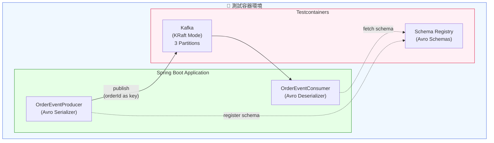
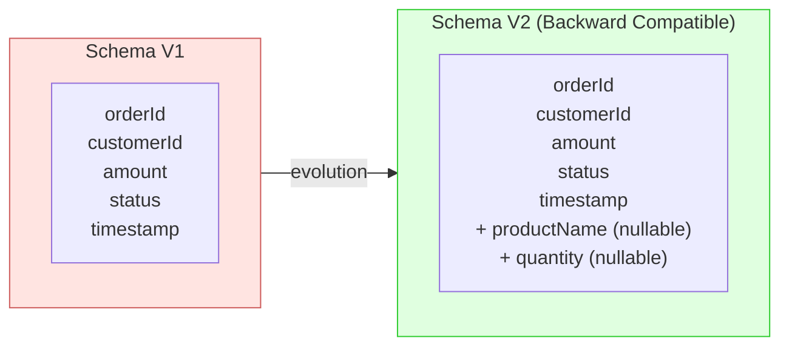

# Scenario S3: Kafka + Schema Registry 整合測試

## 學習目標

完成本場景後，您將學會：
- 使用 Testcontainers 管理 Kafka 和 Schema Registry 容器
- 使用 Avro 進行訊息序列化
- 實作 Schema 版本演進（Backward Compatibility）
- 測試 Kafka 訊息的分區順序保證
- 使用 KRaft 模式（無需 ZooKeeper）

## 環境需求

- Java 21+
- Docker Desktop
- Gradle 8.x

## 概述

S3 場景展示 Apache Kafka 和 Confluent Schema Registry 的整合測試，包含：
- **Kafka Producer/Consumer** - 訊息發送與接收
- **Avro Serialization** - 強型別訊息格式
- **Schema Evolution** - 向後相容的 Schema 演進
- **Partition Ordering** - 相同 Key 的訊息順序保證

## 技術元件

| 元件 | 容器映像 | 用途 |
|------|----------|------|
| Kafka | confluentinc/cp-kafka:7.6.0 | 訊息佇列（KRaft 模式） |
| Schema Registry | confluentinc/cp-schema-registry:7.6.0 | Avro Schema 管理 |

## 核心概念

### 1. KRaft 模式

Kafka 3.0+ 支援 KRaft 模式，無需 ZooKeeper：

```java
KafkaContainer kafka = new KafkaContainer(
    DockerImageName.parse("confluentinc/cp-kafka:7.6.0"))
    .withKraft()  // 啟用 KRaft 模式
    .withReuse(true);
```

### 2. Avro Schema

使用 Avro 定義強型別訊息格式：

```json
{
  "type": "record",
  "name": "OrderEvent",
  "namespace": "com.example.s3.avro",
  "fields": [
    {"name": "orderId", "type": "string"},
    {"name": "customerId", "type": "string"},
    {"name": "amount", "type": "double"},
    {"name": "status", "type": {"type": "enum", "name": "OrderStatus",
        "symbols": ["CREATED", "CONFIRMED", "SHIPPED", "DELIVERED", "CANCELLED"]}},
    {"name": "timestamp", "type": "long"}
  ]
}
```

### 3. Schema Evolution（向後相容）

V2 Schema 新增 nullable 欄位，確保向後相容：

```json
{
  "name": "productName",
  "type": ["null", "string"],
  "default": null,
  "doc": "Product name - optional field added in v2"
}
```

**向後相容規則**：
- ✅ 新增 nullable 欄位（有預設值）
- ✅ 刪除欄位（新消費者忽略舊欄位）
- ❌ 新增 required 欄位（無預設值）
- ❌ 變更欄位型別

### 4. Partition Ordering

相同 Key 的訊息保證順序：

```java
// 使用 orderId 作為 Key，確保同一訂單的事件按順序處理
producer.send(new ProducerRecord<>("order-events", orderId, event));
```

## 教學步驟

### 步驟 1：理解專案結構

```
scenario-s3-kafka/
├── src/main/java/com/example/s3/
│   ├── S3Application.java
│   ├── config/
│   │   └── KafkaConfig.java         # Kafka 配置與 Topic 建立
│   ├── producer/
│   │   └── OrderEventProducer.java  # Kafka Producer
│   └── consumer/
│       └── OrderEventConsumer.java  # Kafka Consumer
├── src/main/resources/
│   ├── application.yml
│   └── avro/
│       ├── order-event-v1.avsc      # V1 Schema
│       └── order-event-v2.avsc      # V2 Schema（向後相容）
└── src/test/java/com/example/s3/
    ├── S3TestApplication.java        # 測試配置
    ├── BaseKafkaIT.java              # 基底測試類別
    ├── KafkaProducerConsumerIT.java  # Producer/Consumer 測試
    └── SchemaEvolutionIT.java        # Schema 演進測試
```

### 步驟 2：執行測試

```bash
# 執行所有測試
./gradlew :scenario-s3-kafka:test

# 執行特定測試類別
./gradlew :scenario-s3-kafka:test --tests "KafkaProducerConsumerIT"
./gradlew :scenario-s3-kafka:test --tests "SchemaEvolutionIT"
```

### 步驟 3：觀察 Schema 演進

1. 註冊 V1 Schema
2. 發送 V1 訊息
3. 註冊 V2 Schema（向後相容）
4. 發送 V2 訊息（包含新欄位）
5. V1 消費者仍可讀取 V2 訊息

## 系統架構



## Schema 演進流程



## 測試類別說明

### KafkaProducerConsumerIT

| 測試案例 | 說明 |
|----------|------|
| `shouldProduceAndConsumeOrderEvent` | 基本訊息發送與接收 |
| `shouldMaintainEventOrderingForSamePartitionKey` | 相同 Key 的順序保證 |
| `shouldHandleMultipleOrdersConcurrently` | 併發訊息處理 |
| `shouldDistributeEventsAcrossPartitions` | 訊息分散到不同分區 |

### SchemaEvolutionIT

| 測試案例 | 說明 |
|----------|------|
| `shouldRegisterV1Schema` | 註冊 V1 Schema |
| `shouldProduceAndConsumeV1Events` | V1 訊息流程 |
| `shouldEvolveSchemaWithBackwardCompatibility` | V1 → V2 演進 |
| `shouldProduceV2EventsWithNewFields` | V2 訊息含新欄位 |
| `shouldProduceV2EventsWithNullOptionalFields` | V2 訊息 nullable 欄位 |
| `shouldHandleMixedV1AndV2Events` | 混合版本處理 |
| `shouldRejectNonBackwardCompatibleSchema` | 拒絕不相容 Schema |
| `shouldListAllSchemaVersions` | 列出所有版本 |

## 程式碼範例

### Producer

```java
@Service
public class OrderEventProducer {

    private final KafkaTemplate<String, GenericRecord> kafkaTemplate;

    public void sendOrderEvent(String orderId, GenericRecord event) {
        // 使用 orderId 作為 Key，確保順序
        kafkaTemplate.send("order-events", orderId, event)
            .whenComplete((result, ex) -> {
                if (ex != null) {
                    log.error("Failed to send event", ex);
                } else {
                    log.info("Event sent to partition {}",
                        result.getRecordMetadata().partition());
                }
            });
    }
}
```

### Consumer

```java
@Service
public class OrderEventConsumer {

    @KafkaListener(topics = "${app.kafka.topics.order-events}")
    public void handleOrderEvent(GenericRecord record) {
        String orderId = record.get("orderId").toString();
        String status = record.get("status").toString();

        // V2 optional 欄位可能為 null
        Object productName = record.get("productName");

        log.info("Received order event: {} - {}", orderId, status);
    }
}
```

### Schema 相容性測試

```java
@Test
void shouldRejectNonBackwardCompatibleSchema() throws Exception {
    // Given - 已註冊 V1 Schema
    String subject = "order-events-test-value";
    schemaRegistryClient.register(subject, new AvroSchema(v1Schema));

    // When - 嘗試註冊不相容的 Schema（新增 required 欄位）
    String incompatibleSchema = """
        {
          "type": "record",
          "name": "OrderEvent",
          "fields": [
            {"name": "orderId", "type": "string"},
            {"name": "requiredNewField", "type": "string"}  // 沒有預設值！
          ]
        }
        """;
    Schema badSchema = new Schema.Parser().parse(incompatibleSchema);

    // Then - Schema Registry 應拒絕
    boolean isCompatible = schemaRegistryClient.testCompatibility(
        subject, new AvroSchema(badSchema));
    assertThat(isCompatible).isFalse();
}
```

## 常見問題

### Q1: Schema 相容性檢查失敗
**問題**: 新 Schema 被 Schema Registry 拒絕
**解決**: 確保新增欄位有預設值（`"default": null`），且型別為 union（`["null", "string"]`）

### Q2: 訊息順序錯亂
**問題**: 同一訂單的事件處理順序不正確
**解決**: 確保使用相同的 partition key（如 orderId）

### Q3: 測試間 Schema 衝突
**問題**: 不同測試註冊的 Schema 互相干擾
**解決**: 在 `@BeforeEach` 中清除 Schema Registry subjects

### Q4: 容器啟動順序問題
**問題**: Schema Registry 在 Kafka 之前啟動導致連線失敗
**解決**: 使用 `dependsOn(kafkaContainer)` 確保啟動順序

## 驗收標準

- ✅ 訊息成功發送與接收
- ✅ 分區順序保證（相同 Key）
- ✅ Schema V1 → V2 向後相容演進
- ✅ 混合版本訊息處理
- ✅ 不相容 Schema 被拒絕

## 設定參考

### application.yml

```yaml
spring:
  kafka:
    bootstrap-servers: ${KAFKA_BOOTSTRAP_SERVERS:localhost:9092}
    producer:
      key-serializer: org.apache.kafka.common.serialization.StringSerializer
      value-serializer: io.confluent.kafka.serializers.KafkaAvroSerializer
    consumer:
      key-deserializer: org.apache.kafka.common.serialization.StringDeserializer
      value-deserializer: io.confluent.kafka.serializers.KafkaAvroDeserializer
      auto-offset-reset: earliest
    properties:
      schema.registry.url: ${SCHEMA_REGISTRY_URL:http://localhost:8081}
      specific.avro.reader: false  # 使用 GenericRecord
```

## 延伸學習

- [S4-CDC](../scenario-s4-cdc/): CDC 變更資料擷取
- [Confluent Schema Registry 文件](https://docs.confluent.io/platform/current/schema-registry/)
- [Avro 規格](https://avro.apache.org/docs/current/spec.html)
- [Kafka Partition 設計](https://kafka.apache.org/documentation/#design_partitioningstrategy)
