# Scenario S3: Kafka + Schema Registry

This scenario demonstrates integration testing with Apache Kafka and Confluent Schema Registry using Testcontainers. It covers message production/consumption with Avro serialization and schema evolution patterns.

## Overview

The scenario implements:
- Kafka producer/consumer with Avro serialization
- Schema Registry for schema management
- Schema evolution with backward compatibility
- Event ordering guarantees within partitions

## Components

### Main Application

| File | Description |
|------|-------------|
| `S3Application.java` | Spring Boot application entry point |
| `KafkaConfig.java` | Kafka configuration and topic creation |
| `OrderEventProducer.java` | Kafka producer for order events |
| `OrderEventConsumer.java` | Kafka consumer for order events |

### Avro Schemas

| File | Description |
|------|-------------|
| `order-event-v1.avsc` | Version 1 schema with base fields |
| `order-event-v2.avsc` | Version 2 schema with nullable productName and quantity fields |

### Tests

| File | Description |
|------|-------------|
| `S3TestApplication.java` | Test configuration with Kafka and Schema Registry containers |
| `KafkaProducerConsumerIT.java` | Tests message production and consumption |
| `SchemaEvolutionIT.java` | Tests schema compatibility and evolution |

## Key Features

### KRaft Mode (No ZooKeeper)

The Kafka container uses KRaft mode, which eliminates the need for ZooKeeper:

```java
KafkaContainer kafka = new KafkaContainer("apache/kafka:3.9.0")
    .withNetwork(NETWORK)
    .withNetworkAliases("kafka")
    .withReuse(true);
```

### Schema Evolution

The scenario demonstrates backward compatible schema evolution:

**V1 Schema** - Base fields:
- orderId, customerId, amount, status, timestamp

**V2 Schema** - Adds nullable fields:
- productName (optional, default null)
- quantity (optional, default null)

This allows V2 consumers to read V1 messages (null values for new fields).

### Partition Ordering

Events with the same key (orderId) are guaranteed to be processed in order:

```java
// Same orderId = same partition = ordered processing
orderEventProducer.sendOrderEventSync(orderId, event1);
orderEventProducer.sendOrderEventSync(orderId, event2);
orderEventProducer.sendOrderEventSync(orderId, event3);
```

## Test Scenarios

### KafkaProducerConsumerIT

1. **shouldProduceAndConsumeOrderEvent** - Basic produce/consume flow
2. **shouldMaintainEventOrderingForSamePartitionKey** - Order guarantee verification
3. **shouldHandleMultipleOrdersConcurrently** - Concurrent order processing
4. **shouldDistributeEventsAcrossPartitions** - Partition distribution

### SchemaEvolutionIT

1. **shouldRegisterV1Schema** - Schema registration
2. **shouldProduceAndConsumeV1Events** - V1 message flow
3. **shouldEvolveSchemaWithBackwardCompatibility** - V1 to V2 evolution
4. **shouldProduceV2EventsWithNewFields** - V2 with new fields
5. **shouldProduceV2EventsWithNullOptionalFields** - V2 with null optionals
6. **shouldHandleMixedV1AndV2Events** - Mixed version processing
7. **shouldVerifySchemaCompatibilityMode** - Compatibility mode check
8. **shouldRejectNonBackwardCompatibleSchema** - Incompatible schema rejection
9. **shouldListAllSchemaVersions** - Schema version listing

## Running Tests

```bash
# Run all tests
./gradlew :scenario-s3-kafka:test

# Run specific test class
./gradlew :scenario-s3-kafka:test --tests "KafkaProducerConsumerIT"
./gradlew :scenario-s3-kafka:test --tests "SchemaEvolutionIT"
```

## Configuration

### application.yml

```yaml
spring:
  kafka:
    bootstrap-servers: ${KAFKA_BOOTSTRAP_SERVERS:localhost:9092}
    producer:
      key-serializer: org.apache.kafka.common.serialization.StringSerializer
      value-serializer: io.confluent.kafka.serializers.KafkaAvroSerializer
    consumer:
      key-deserializer: org.apache.kafka.common.serialization.StringDeserializer
      value-deserializer: io.confluent.kafka.serializers.KafkaAvroDeserializer
    properties:
      schema.registry.url: ${SCHEMA_REGISTRY_URL:http://localhost:8081}
```

## Dependencies

The scenario uses the following key dependencies:
- `org.springframework.kafka:spring-kafka` - Spring Kafka support
- `org.apache.avro:avro` - Avro serialization
- `io.confluent:kafka-avro-serializer` - Confluent Avro serializer
- `org.testcontainers:kafka` - Kafka testcontainer

## Container Factories

This scenario uses the following factories from `tc-common`:
- `KafkaContainerFactory` - Creates Kafka containers in KRaft mode
- `SchemaRegistryContainerFactory` - Creates Schema Registry containers

## Architecture

```mermaid
flowchart TB
    subgraph Test["🧪 測試容器環境"]
        subgraph App["Spring Boot Application"]
            Producer["OrderEventProducer\n(Avro Serializer)"]
            Consumer["OrderEventConsumer\n(Avro Deserializer)"]
        end

        subgraph Containers["Testcontainers"]
            Kafka["Kafka\n(KRaft Mode)\n3 Partitions"]
            SR["Schema Registry\n(Avro Schemas)"]
        end
    end

    Producer -->|"publish\n(orderId as key)"| Kafka
    Kafka --> Consumer
    Producer -.->|"register schema"| SR
    Consumer -.->|"fetch schema"| SR

    style Test fill:#f0f8ff,stroke:#4169e1
    style App fill:#e6ffe6,stroke:#228b22
    style Containers fill:#fff0f5,stroke:#dc143c
```



### Schema Evolution


