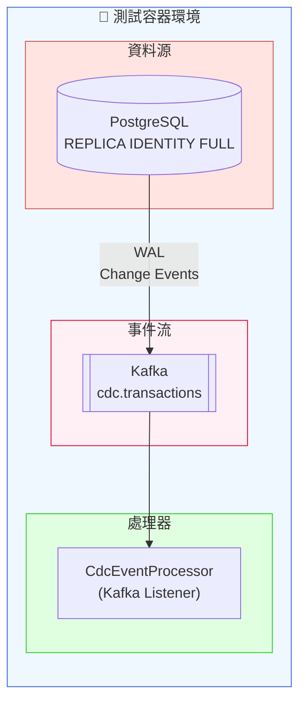
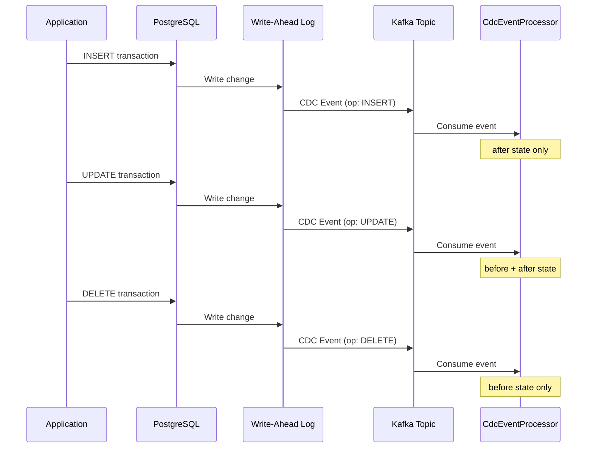

# Scenario S4: CDC (Change Data Capture) 變更資料擷取

## 學習目標

完成本場景後，您將學會：
- 理解 CDC（Change Data Capture）的運作原理
- 使用 PostgreSQL 的 `REPLICA IDENTITY FULL` 配置
- 處理 INSERT、UPDATE、DELETE 三種 CDC 事件
- 驗證 CDC 事件的 before/after 狀態
- 測試 CDC 事件的時效性（SLA）

## 環境需求

- Java 21+
- Docker Desktop
- Gradle 8.x

## 概述

CDC（Change Data Capture）是一種擷取資料庫變更的技術，將每一次的 INSERT、UPDATE、DELETE 操作轉換為事件串流。本場景模擬 Debezium CDC 的行為，展示如何測試 CDC 事件處理邏輯。

### CDC 的實際應用場景
- **資料同步**：將變更同步到其他系統（如搜尋引擎、快取）
- **審計追蹤**：記錄所有資料變更歷史
- **事件驅動架構**：基於資料變更觸發業務流程
- **資料湖更新**：即時更新分析資料

## 技術元件

| 元件 | 容器映像 | 用途 |
|------|----------|------|
| PostgreSQL | postgres:16-alpine | 資料來源（啟用 REPLICA IDENTITY FULL） |
| Kafka | confluentinc/cp-kafka:7.6.0 | CDC 事件串流 |

## 核心概念

### 1. REPLICA IDENTITY FULL

PostgreSQL 預設只在 UPDATE/DELETE 時記錄 Primary Key，設定 `REPLICA IDENTITY FULL` 後會記錄完整列資料：

```sql
ALTER TABLE transactions REPLICA IDENTITY FULL;
```

### 2. CDC 事件格式

遵循 Debezium 格式：

```json
{
  "operation": "UPDATE",
  "table": "transactions",
  "before": {
    "id": "uuid",
    "amount": 100.00,
    "balance": 500.00
  },
  "after": {
    "id": "uuid",
    "amount": 100.00,
    "balance": 600.00
  },
  "timestamp": 1705312200000
}
```

### 3. 操作類型對應

| 操作 | before | after | 說明 |
|------|--------|-------|------|
| INSERT | null | 完整列 | 新增資料 |
| UPDATE | 完整列 | 完整列 | 修改資料 |
| DELETE | 完整列 | null | 刪除資料 |

## 教學步驟

### 步驟 1：理解專案結構

```
scenario-s4-cdc/
├── src/main/java/com/example/s4/
│   ├── S4Application.java
│   ├── domain/
│   │   ├── Transaction.java         # 交易實體
│   │   └── TransactionType.java     # 交易類型（DEPOSIT, WITHDRAWAL, TRANSFER）
│   ├── repository/
│   │   └── TransactionRepository.java
│   ├── service/
│   │   └── TransactionService.java
│   └── cdc/
│       ├── CdcEvent.java            # CDC 事件結構
│       └── CdcEventProcessor.java   # CDC 事件處理器
├── src/main/resources/
│   ├── application.yml
│   └── db/migration/
│       └── V1__create_transactions_table.sql
└── src/test/java/com/example/s4/
    ├── S4TestApplication.java
    ├── DebeziumCdcIT.java           # CDC 事件擷取測試
    └── CdcSchemaChangeIT.java       # Schema 變更容錯測試
```

### 步驟 2：執行測試

```bash
# 執行所有 S4 測試
./gradlew :scenario-s4-cdc:test

# 執行特定測試類別
./gradlew :scenario-s4-cdc:test --tests "DebeziumCdcIT"
./gradlew :scenario-s4-cdc:test --tests "CdcSchemaChangeIT"

# 帶詳細輸出
./gradlew :scenario-s4-cdc:test --info
```

### 步驟 3：觀察 CDC 事件流

1. 建立交易（INSERT）→ 產生 CDC 事件（after 有值）
2. 更新交易（UPDATE）→ 產生 CDC 事件（before/after 都有值）
3. 刪除交易（DELETE）→ 產生 CDC 事件（before 有值）

## 系統架構



## CDC 事件流程



## 測試類別說明

### DebeziumCdcIT - CDC 事件擷取測試

| 測試案例 | 說明 | SLA |
|----------|------|-----|
| `shouldCaptureInsertEventWithinThreeSeconds` | INSERT 事件包含 after 狀態 | 3秒 |
| `shouldCaptureUpdateEventWithBeforeAndAfterState` | UPDATE 事件包含 before/after | 3秒 |
| `shouldCaptureDeleteEventWithBeforeState` | DELETE 事件包含 before 狀態 | 3秒 |
| `shouldCaptureMultipleCdcOperations` | 連續操作的 CDC 事件 | - |
| `shouldCaptureTransactionTypeInCdcEvent` | 各種交易類型的事件 | - |

### CdcSchemaChangeIT - Schema 變更容錯測試

| 測試案例 | 說明 |
|----------|------|
| `shouldHandleEventsWithExtraFields` | 處理含額外欄位的事件 |
| `shouldHandleEventsWithMissingFields` | 處理缺少欄位的事件 |
| `shouldHandleNewColumnAddition` | Schema 新增欄位後的相容性 |
| `shouldHandleDataTypeVariations` | 不同資料型別表示法 |
| `shouldVerifyReplicaIdentityFull` | 驗證 REPLICA IDENTITY FULL 配置 |
| `shouldIncludeAllColumnsInBeforeState` | UPDATE 時 before 包含所有欄位 |

## 程式碼範例

### CDC 事件結構

```java
public record CdcEvent(
    String operation,    // INSERT, UPDATE, DELETE
    String table,
    Map<String, Object> before,
    Map<String, Object> after,
    long timestamp
) {
    public boolean isInsert() { return "INSERT".equals(operation); }
    public boolean isUpdate() { return "UPDATE".equals(operation); }
    public boolean isDelete() { return "DELETE".equals(operation); }
}
```

### CDC 事件處理器

```java
@Service
public class CdcEventProcessor {

    private final List<CdcEvent> receivedEvents = new CopyOnWriteArrayList<>();

    @KafkaListener(topics = "${cdc.topic}")
    public void processCdcEvent(CdcEvent event) {
        log.info("Received CDC event: {} on {}", event.operation(), event.table());

        if (event.isUpdate()) {
            // 可以比較 before 和 after 狀態
            log.info("Before: {}", event.before());
            log.info("After: {}", event.after());
        }

        receivedEvents.add(event);
    }

    public List<CdcEvent> getEventsForTable(String table) {
        return receivedEvents.stream()
            .filter(e -> table.equals(e.table()))
            .toList();
    }
}
```

### CDC 測試

```java
@Test
void shouldCaptureUpdateEventWithBeforeAndAfterState() {
    // Given - 建立交易
    Transaction tx = transactionService.createDeposit("ACC001", new BigDecimal("100.00"));
    BigDecimal originalBalance = tx.getBalance();

    // When - 更新交易
    transactionService.updateBalance(tx.getId(), new BigDecimal("150.00"));

    // Then - 驗證 CDC 事件（3秒 SLA）
    await().atMost(3, TimeUnit.SECONDS)
           .until(() -> cdcProcessor.getEventsForTable("transactions")
                                    .stream()
                                    .anyMatch(CdcEvent::isUpdate));

    CdcEvent updateEvent = cdcProcessor.getEventsForTable("transactions")
        .stream()
        .filter(CdcEvent::isUpdate)
        .findFirst()
        .orElseThrow();

    // 驗證 before 狀態
    assertThat(updateEvent.before()).containsEntry("balance", originalBalance);

    // 驗證 after 狀態
    assertThat(updateEvent.after()).containsEntry("balance", new BigDecimal("150.00"));
}
```

## 常見問題

### Q1: before 狀態為空
**問題**: UPDATE/DELETE 事件的 before 為 null
**解決**: 確認 `ALTER TABLE xxx REPLICA IDENTITY FULL` 已執行

### Q2: CDC 事件延遲超過 SLA
**問題**: 事件未在 3 秒內到達
**解決**: 檢查 Kafka consumer 配置，確保 `auto.offset.reset=earliest`

### Q3: 欄位名稱不一致
**問題**: CDC 事件的欄位名稱與實體不同
**解決**: PostgreSQL 預設使用 snake_case，需要處理命名轉換

### Q4: 併發事件順序
**問題**: 多個 CDC 事件的處理順序不可預期
**解決**: 使用相同的 partition key（如 entity ID）確保順序

## 效能需求

- **SC-012**: CDC 事件必須在 3 秒內到達
- 使用 `AwaitHelper.waitForCdcEvent()` 強制執行此 SLA

## 生產環境考量

部署 Debezium 到生產環境需要：

1. **Debezium Connect 叢集**: 部署 Kafka Connect with Debezium PostgreSQL connector
2. **PostgreSQL 配置**: 啟用 logical replication（`wal_level = logical`）
3. **Replication Slot**: Debezium 建立 replication slot 串流 WAL
4. **Schema Registry**: 使用 Avro 序列化處理 schema 演進
5. **監控**: 追蹤 replication lag 和 connector 健康狀態

## 驗收標準

- ✅ INSERT 事件在 3 秒內擷取（SC-012）
- ✅ UPDATE 事件包含 before/after 狀態
- ✅ DELETE 事件包含 before 狀態
- ✅ Schema 變更不影響事件處理
- ✅ REPLICA IDENTITY FULL 正確配置

## 延伸學習

- [S3-Kafka](../scenario-s3-kafka/): Kafka 訊息基礎
- [Debezium 官方文件](https://debezium.io/documentation/)
- [PostgreSQL Logical Replication](https://www.postgresql.org/docs/current/logical-replication.html)
- [CDC 模式最佳實踐](https://debezium.io/documentation/reference/stable/connectors/postgresql.html)
