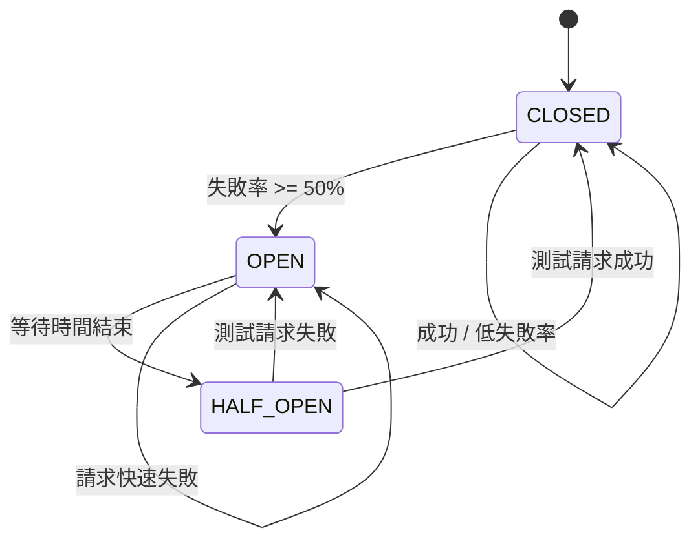
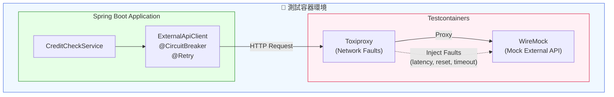

# Scenario S5: 韌性測試 (Resilience Testing)

## 學習目標

完成本場景後，您將學會：
- 使用 WireMock 模擬外部 API 回應
- 使用 Toxiproxy 注入網路故障
- 實作 Circuit Breaker（熔斷器）模式
- 實作 Retry（重試）和 Fallback（降級）模式
- 測試系統在故障情況下的行為

## 環境需求

- Java 21+
- Docker Desktop
- Gradle 8.x

## 概述

S5 場景驗證應用程式在外部服務失敗時的韌性能力，包含：
- **Circuit Breaker**: 防止連鎖失敗
- **Retry**: 處理暫時性故障
- **Fallback**: 提供優雅降級
- **Timeout**: 處理慢回應

這是微服務架構中必備的韌性模式，確保單一服務失敗不會導致整個系統崩潰。

## 技術元件

| 元件 | 容器映像 | 用途 |
|------|----------|------|
| WireMock | wiremock/wiremock:3.4.2 | 模擬外部 API |
| Toxiproxy | ghcr.io/shopify/toxiproxy:2.9.0 | 注入網路故障 |

## 核心概念

### 1. Circuit Breaker（熔斷器）

熔斷器有三種狀態：



### 2. WireMock 模擬

模擬外部 API 的各種回應：

```java
// 成功回應
wireMock.stubFor(get(urlPathEqualTo("/api/credit/" + customerId))
    .willReturn(okJson("""
        {"customerId": "%s", "approved": true, "limit": 10000}
        """.formatted(customerId))));

// 服務器錯誤
wireMock.stubFor(get(urlPathEqualTo("/api/credit/" + customerId))
    .willReturn(serverError()));

// 延遲回應
wireMock.stubFor(get(urlPathEqualTo("/api/credit/" + customerId))
    .willReturn(ok().withFixedDelay(5000)));  // 5秒延遲
```

### 3. Toxiproxy 故障注入

模擬真實網路故障：

```java
// 網路延遲
proxy.toxics().latency("latency", ToxicDirection.DOWNSTREAM, 3000);

// 連線重置
proxy.toxics().resetPeer("reset", ToxicDirection.DOWNSTREAM, 0);

// 連線逾時
proxy.toxics().timeout("timeout", ToxicDirection.DOWNSTREAM, 5000);

// 頻寬限制
proxy.toxics().bandwidth("bandwidth", ToxicDirection.DOWNSTREAM, 1024);
```

## 教學步驟

### 步驟 1：理解專案結構

```
scenario-s5-resilience/
├── src/main/java/com/example/s5/
│   ├── S5Application.java
│   ├── client/
│   │   ├── ExternalApiClient.java      # HTTP Client（含韌性註解）
│   │   ├── ExternalServiceException.java
│   │   └── dto/
│   │       └── CreditCheckResponse.java
│   ├── service/
│   │   ├── CreditCheckService.java     # 業務邏輯服務
│   │   └── dto/
│   │       └── CreditDecision.java
│   └── config/
│       └── ResilienceConfig.java
├── src/main/resources/
│   └── application.yml                  # Resilience4j 配置
└── src/test/java/com/example/s5/
    ├── S5TestApplication.java
    ├── WireMockApiIT.java               # API 模擬測試
    ├── ToxiproxyFaultIT.java            # 網路故障測試
    └── CircuitBreakerIT.java            # 熔斷器狀態測試
```

### 步驟 2：執行測試

```bash
# 執行所有 S5 測試
./gradlew :scenario-s5-resilience:test

# 執行特定測試類別
./gradlew :scenario-s5-resilience:test --tests "WireMockApiIT"
./gradlew :scenario-s5-resilience:test --tests "ToxiproxyFaultIT"
./gradlew :scenario-s5-resilience:test --tests "CircuitBreakerIT"
```

### 步驟 3：觀察韌性行為

1. 正常回應 → 直接返回結果
2. 服務錯誤 → 觸發 Fallback
3. 連續失敗 → Circuit Breaker 開啟
4. 等待後 → Circuit Breaker 半開，允許測試請求
5. 測試成功 → Circuit Breaker 關閉

## 系統架構



## 測試類別說明

### WireMockApiIT - API 模擬測試

| 測試案例 | 說明 |
|----------|------|
| `shouldReturnApprovedCreditOnSuccess` | 成功回應處理 |
| `shouldReturnDeniedCreditWhenApiReturnsDenied` | 拒絕回應處理 |
| `shouldUseFallbackOnServerError` | 500 錯誤觸發 Fallback |
| `shouldUseFallbackOnServiceUnavailable` | 503 錯誤觸發 Fallback |
| `shouldHandleDelayAndUseFallback` | 逾時觸發 Fallback |
| `shouldHandle404AsError` | 404 錯誤處理 |

### ToxiproxyFaultIT - 網路故障測試

| 測試案例 | 說明 |
|----------|------|
| `shouldHandleNetworkLatencyWithinTimeout` | 可接受延遲內成功 |
| `shouldUseFallbackWhenLatencyExceedsTimeout` | 延遲超時觸發 Fallback |
| `shouldUseFallbackOnConnectionReset` | 連線重置觸發 Fallback |
| `shouldUseFallbackOnConnectionTimeout` | 連線逾時觸發 Fallback |
| `shouldHandleBandwidthLimitation` | 頻寬限制處理 |
| `shouldRecoverAfterNetworkIssueResolved` | 故障恢復後正常運作 |
| `shouldHandleIntermittentNetworkIssues` | 間歇性網路問題處理 |

### CircuitBreakerIT - 熔斷器測試

| 測試案例 | 說明 |
|----------|------|
| `shouldStartClosed` | 初始狀態為 CLOSED |
| `shouldStayClosedOnSuccess` | 成功時保持 CLOSED |
| `shouldOpenAfterConsecutiveFailures` | 連續失敗後開啟 |
| `shouldUseFallbackWhenOpen` | OPEN 時使用 Fallback |
| `shouldTransitionToHalfOpen` | 等待後轉為 HALF_OPEN |
| `shouldCloseFromHalfOpenOnSuccess` | HALF_OPEN 成功後關閉 |
| `shouldReturnToOpenFromHalfOpenOnFailure` | HALF_OPEN 失敗後開啟 |
| `shouldTrackMetrics` | 指標追蹤正確 |

## 程式碼範例

### Resilience4j 配置

```yaml
resilience4j:
  circuitbreaker:
    instances:
      creditCheck:
        slidingWindowType: COUNT_BASED
        slidingWindowSize: 5
        minimumNumberOfCalls: 3
        failureRateThreshold: 50
        waitDurationInOpenState: 10s
        permittedNumberOfCallsInHalfOpenState: 2
        automaticTransitionFromOpenToHalfOpenEnabled: true

  retry:
    instances:
      creditCheck:
        maxAttempts: 3
        waitDuration: 1s
        enableExponentialBackoff: true
        exponentialBackoffMultiplier: 2
```

### Client 實作

```java
@Service
public class ExternalApiClient {

    @CircuitBreaker(name = "creditCheck", fallbackMethod = "creditCheckFallback")
    @Retry(name = "creditCheck")
    public CreditCheckResponse checkCredit(String customerId) {
        return restTemplate.getForObject(
            baseUrl + "/api/credit/" + customerId,
            CreditCheckResponse.class
        );
    }

    // Fallback 方法 - 保守策略：拒絕信用
    private CreditCheckResponse creditCheckFallback(String customerId, Throwable t) {
        log.warn("Using fallback for customer {}: {}", customerId, t.getMessage());
        return new CreditCheckResponse(
            customerId,
            false,           // 不核准
            0,               // 無額度
            "FALLBACK",
            "Service temporarily unavailable"
        );
    }
}
```

### Toxiproxy 故障注入測試

```java
@Test
void shouldUseFallbackWhenLatencyExceedsTimeout() throws Exception {
    // Given - 設定成功回應
    setupSuccessStub(customerId);

    // When - 注入超過逾時的延遲
    proxy.toxics().latency("high-latency", ToxicDirection.DOWNSTREAM, 5000);

    // Then - 應使用 Fallback
    CreditDecision decision = creditCheckService.evaluate(customerId, BigDecimal.valueOf(1000));

    assertThat(decision.approved()).isFalse();
    assertThat(decision.reason()).contains("FALLBACK");
}

@Test
void shouldRecoverAfterNetworkIssueResolved() throws Exception {
    // Given - 注入故障
    Toxic timeout = proxy.toxics().timeout("timeout", ToxicDirection.DOWNSTREAM, 0);

    // When - 故障期間的請求
    CreditDecision failedDecision = creditCheckService.evaluate(customerId, BigDecimal.valueOf(1000));
    assertThat(failedDecision.approved()).isFalse();

    // Then - 移除故障後恢復
    timeout.remove();
    setupSuccessStub(customerId);

    CreditDecision recoveredDecision = creditCheckService.evaluate(customerId, BigDecimal.valueOf(1000));
    assertThat(recoveredDecision.approved()).isTrue();
}
```

## Toxiproxy 故障類型

| 故障類型 | 說明 | 使用場景 |
|----------|------|----------|
| `latency` | 增加回應延遲 | 測試逾時處理 |
| `bandwidth` | 限制資料傳輸速率 | 測試慢網路 |
| `timeout` | 在延遲後停止資料傳輸 | 測試連線逾時 |
| `reset_peer` | 重置 TCP 連線 | 測試連線失敗 |
| `slicer` | 將資料切成小塊 | 測試分片回應 |

## 常見問題

### Q1: Circuit Breaker 不開啟
**問題**: 連續失敗但 Circuit Breaker 未開啟
**解決**: 確認 `minimumNumberOfCalls` 和 `slidingWindowSize` 配置正確

### Q2: Toxiproxy 連線失敗
**問題**: 測試無法連接到 Toxiproxy
**解決**: 確認 Proxy 端口映射正確，使用 `proxy.getProxyPort()`

### Q3: Fallback 未被調用
**問題**: 異常發生但 Fallback 未執行
**解決**: 確認 Fallback 方法簽名正確（參數須包含 Throwable）

### Q4: 測試不穩定
**問題**: 熔斷器狀態測試偶爾失敗
**解決**: 在每個測試前重置 Circuit Breaker 狀態

## 驗收標準（US8）

- ✅ 外部服務錯誤時使用 Fallback
- ✅ 請求逾時時觸發逾時處理
- ✅ 連續失敗達閾值時熔斷器開啟
- ✅ 熔斷器半開狀態下請求成功時關閉熔斷器

## 延伸學習

- [S6-Security](../scenario-s6-security/): OAuth2 安全測試
- [Resilience4j 官方文件](https://resilience4j.readme.io/)
- [WireMock 官方文件](https://wiremock.org/docs/)
- [Toxiproxy GitHub](https://github.com/Shopify/toxiproxy)
- [Testcontainers Toxiproxy Module](https://www.testcontainers.org/modules/toxiproxy/)
