# Scenario S5: Resilience Testing with WireMock and Toxiproxy

This module demonstrates resilience testing patterns using Testcontainers with WireMock for API mocking and Toxiproxy for network fault injection.

## Overview

The S5 Resilience scenario validates the application's ability to handle external service failures gracefully. It implements and tests:

- **Circuit Breaker Pattern**: Prevents cascade failures when external services are unavailable
- **Retry Pattern**: Handles transient failures with exponential backoff
- **Fallback Pattern**: Provides graceful degradation when services fail
- **Timeout Handling**: Properly handles slow responses

## Technologies Used

| Technology | Purpose |
|------------|---------|
| WireMock | Mock external HTTP APIs for testing |
| Toxiproxy | Simulate network faults (latency, disconnects, timeouts) |
| Resilience4j | Implement circuit breaker, retry, and fallback patterns |
| Spring Boot 3.4.x | Application framework |
| Testcontainers | Manage test containers lifecycle |

## Project Structure

```
scenario-s5-resilience/
├── src/main/java/com/example/s5/
│   ├── S5Application.java                 # Spring Boot application
│   ├── client/
│   │   ├── ExternalApiClient.java         # HTTP client with resilience annotations
│   │   ├── ExternalServiceException.java  # Custom exception
│   │   └── dto/
│   │       └── CreditCheckResponse.java   # API response DTO
│   ├── service/
│   │   ├── CreditCheckService.java        # Business logic service
│   │   └── dto/
│   │       └── CreditDecision.java        # Decision DTO
│   └── config/
│       └── ResilienceConfig.java          # Resilience4j configuration
├── src/main/resources/
│   └── application.yml                    # Application and Resilience4j config
└── src/test/java/com/example/s5/
    ├── S5TestApplication.java             # Test configuration
    ├── WireMockApiIT.java                 # API mocking tests
    ├── ToxiproxyFaultIT.java              # Network fault injection tests
    └── CircuitBreakerIT.java              # Circuit breaker state transition tests
```

## Running Tests

```bash
# Run all S5 tests
./gradlew :scenario-s5-resilience:test

# Run specific test class
./gradlew :scenario-s5-resilience:test --tests "WireMockApiIT"
./gradlew :scenario-s5-resilience:test --tests "ToxiproxyFaultIT"
./gradlew :scenario-s5-resilience:test --tests "CircuitBreakerIT"
```

## Test Scenarios

### WireMockApiIT - External API Mocking

Tests external API interactions using WireMock:

| Test | Description |
|------|-------------|
| `shouldReturnApprovedCreditOnSuccess` | Verifies successful credit check |
| `shouldReturnDeniedCreditWhenApiReturnsDenied` | Verifies denied credit response |
| `shouldUseFallbackOnServerError` | Verifies fallback on 500 error |
| `shouldUseFallbackOnServiceUnavailable` | Verifies fallback on 503 error |
| `shouldHandleDelayAndUseFallback` | Verifies timeout handling |
| `shouldHandle404AsError` | Verifies 404 handling |
| `shouldEvaluateCreditDecisionBasedOnAmount` | Verifies credit limit evaluation |
| `shouldApproveCreditWhenAmountWithinLimit` | Verifies successful approval |

### ToxiproxyFaultIT - Network Fault Injection

Tests network failure scenarios using Toxiproxy:

| Test | Description |
|------|-------------|
| `shouldHandleNetworkLatencyWithinTimeout` | Handles acceptable latency |
| `shouldUseFallbackWhenLatencyExceedsTimeout` | Fallback on timeout |
| `shouldUseFallbackOnConnectionReset` | Handles connection reset |
| `shouldUseFallbackOnConnectionTimeout` | Handles connection timeout |
| `shouldHandleBandwidthLimitation` | Handles slow network |
| `shouldRecoverAfterNetworkIssueResolved` | Recovery after fault cleared |
| `shouldHandleIntermittentNetworkIssues` | Handles jitter/intermittent faults |
| `shouldReportCorrectDecisionUsingFallback` | Correct decision on fallback |

### CircuitBreakerIT - Circuit Breaker State Transitions

Tests circuit breaker behavior:

| Test | Description |
|------|-------------|
| `circuitBreakerShouldStartClosed` | Initial state is CLOSED |
| `circuitBreakerShouldStayClosedOnSuccess` | Stays CLOSED on success |
| `circuitBreakerShouldOpenAfterConsecutiveFailures` | CLOSED -> OPEN on failures |
| `circuitBreakerShouldUseFallbackWhenOpen` | Uses fallback when OPEN |
| `circuitBreakerShouldTransitionToHalfOpen` | OPEN -> HALF_OPEN after wait |
| `circuitBreakerShouldCloseFromHalfOpenOnSuccess` | HALF_OPEN -> CLOSED on success |
| `circuitBreakerShouldReturnToOpenFromHalfOpenOnFailure` | HALF_OPEN -> OPEN on failure |
| `circuitBreakerMetricsShouldBeAccurate` | Metrics are correctly tracked |
| `shouldBeAbleToManuallyResetCircuitBreaker` | Manual reset works |
| `circuitBreakerShouldHandleMixedScenarios` | Mixed success/failure handling |

## Circuit Breaker Configuration

The circuit breaker is configured with the following parameters:

```yaml
resilience4j:
  circuitbreaker:
    instances:
      creditCheck:
        slidingWindowType: COUNT_BASED
        slidingWindowSize: 5
        minimumNumberOfCalls: 3
        failureRateThreshold: 50
        waitDurationInOpenState: 10s
        permittedNumberOfCallsInHalfOpenState: 2
        automaticTransitionFromOpenToHalfOpenEnabled: true
```

### State Transition Diagram

```mermaid
stateDiagram-v2
    [*] --> CLOSED

    CLOSED --> OPEN : failure rate >= 50%
    CLOSED --> CLOSED : success / low failure rate

    OPEN --> HALF_OPEN : wait duration elapsed
    OPEN --> OPEN : requests fail fast (fallback)

    HALF_OPEN --> CLOSED : test request succeeds
    HALF_OPEN --> OPEN : test request fails

    note right of CLOSED
        正常狀態
        所有請求通過
    end note

    note right of OPEN
        熔斷狀態
        所有請求使用 fallback
    end note

    note right of HALF_OPEN
        半開狀態
        允許少量測試請求
    end note
```



### 系統架構


## Resilience Patterns

### 1. Circuit Breaker

Prevents cascade failures by failing fast when the error rate exceeds a threshold.

```java
@CircuitBreaker(name = "creditCheck", fallbackMethod = "creditCheckFallback")
public CreditCheckResponse checkCredit(String customerId) {
    // API call
}

public CreditCheckResponse creditCheckFallback(String customerId, Throwable t) {
    // Return fallback response
}
```

### 2. Retry

Automatically retries failed calls with exponential backoff.

```java
@Retry(name = "creditCheck")
public CreditCheckResponse checkCredit(String customerId) {
    // API call - will be retried on failure
}
```

### 3. Fallback

Provides a graceful degradation path when the primary operation fails.

```java
public CreditCheckResponse creditCheckFallback(String customerId, Throwable t) {
    return new CreditCheckResponse(
        customerId,
        false,  // Conservative: deny credit on failure
        0,
        "FALLBACK",
        "Service temporarily unavailable"
    );
}
```

## Toxiproxy Fault Types

| Fault Type | Description | Use Case |
|------------|-------------|----------|
| `latency` | Adds delay to responses | Test timeout handling |
| `bandwidth` | Limits data transfer rate | Test slow network |
| `timeout` | Stops data after delay | Test connection timeout |
| `reset_peer` | Resets TCP connection | Test connection failures |
| `slicer` | Slices data into smaller chunks | Test fragmented responses |

## Acceptance Criteria (US8)

This module validates the following acceptance scenarios from the specification:

1. **Given** external service returns error, **When** system processes request, **Then** uses fallback response
2. **Given** external service delays too long, **When** request times out, **Then** triggers timeout handling
3. **Given** consecutive failures reach threshold, **When** circuit breaker opens, **Then** subsequent requests use fallback
4. **Given** circuit breaker in half-open state, **When** request succeeds, **Then** circuit breaker closes

## Dependencies

This module uses the following dependencies from `tc-common`:

- `WireMockContainerFactory` - Creates WireMock containers
- `ToxiproxyContainerFactory` - Creates Toxiproxy containers
- `IntegrationTestBase` - Base class with common test utilities

## References

- [Resilience4j Documentation](https://resilience4j.readme.io/)
- [WireMock Documentation](https://wiremock.org/docs/)
- [Toxiproxy Documentation](https://github.com/Shopify/toxiproxy)
- [Testcontainers Toxiproxy Module](https://www.testcontainers.org/modules/toxiproxy/)
