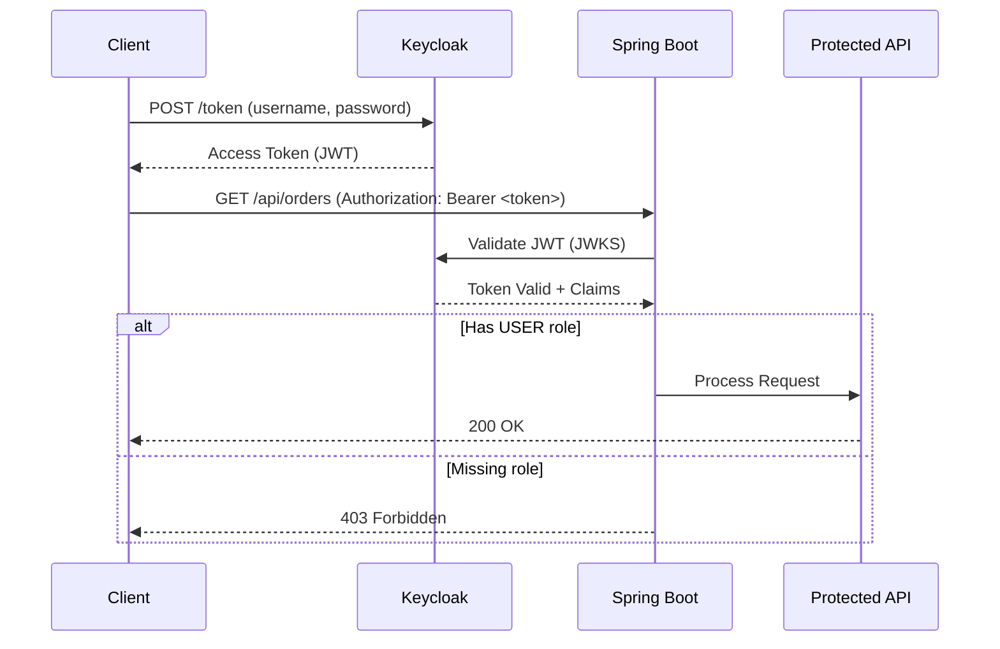
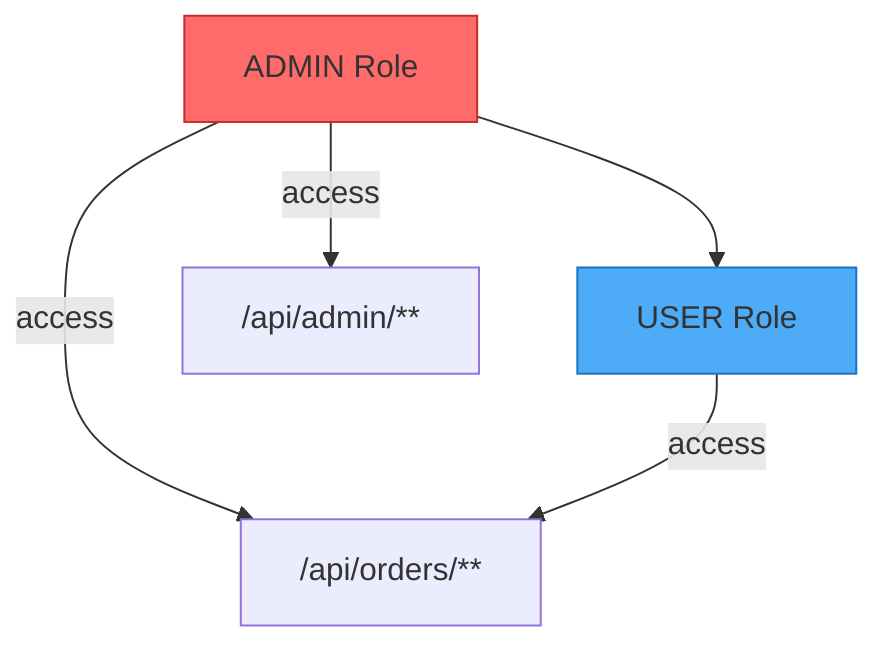
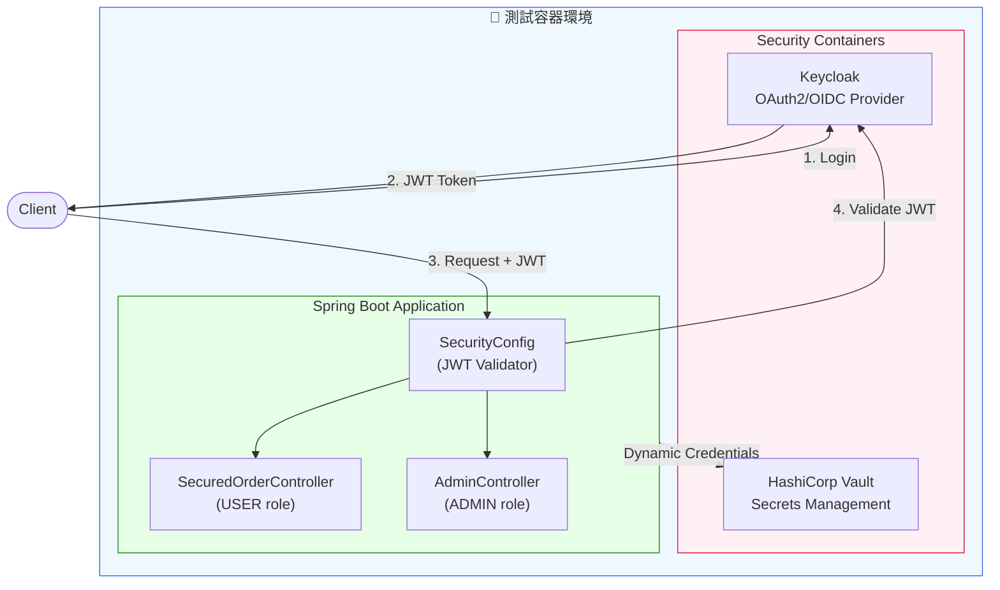

# Scenario S6: 安全性整合測試 (OAuth2/OIDC + Vault)

## 學習目標

完成本場景後，您將學會：
- 使用 Keycloak 實作 OAuth2/OIDC 認證
- 測試 JWT Token 驗證流程
- 實作角色基礎存取控制（RBAC）
- 使用 HashiCorp Vault 管理敏感資訊
- 測試動態憑證和秘密輪換

## 環境需求

- Java 21+
- Docker Desktop（需要足夠記憶體）
- Gradle 8.x

## 概述

S6 場景展示安全性相關的整合測試：
- **OAuth2 Resource Server** - JWT Token 驗證
- **Keycloak** - 身份認證與授權
- **HashiCorp Vault** - 秘密管理
- **RBAC** - 角色基礎存取控制

## 技術元件

| 元件 | 容器映像 | 用途 |
|------|----------|------|
| Keycloak | quay.io/keycloak/keycloak:24.0.1 | OAuth2/OIDC Provider |
| Vault | hashicorp/vault:1.15 | 秘密管理 |

## 核心概念

### 1. OAuth2 認證流程



### 2. 角色階層



### 3. JWT Token 結構

```json
{
  "sub": "user-uuid",
  "preferred_username": "john",
  "realm_access": {
    "roles": ["USER", "ADMIN"]
  },
  "exp": 1705312200
}
```

## 教學步驟

### 步驟 1：理解專案結構

```
scenario-s6-security/
├── src/main/java/com/example/s6/
│   ├── S6Application.java
│   ├── config/
│   │   └── SecurityConfig.java       # OAuth2 + JWT 配置
│   ├── controller/
│   │   ├── SecuredOrderController.java  # USER 角色端點
│   │   └── AdminController.java         # ADMIN 角色端點
│   └── service/
│       └── OrderService.java
├── src/main/resources/
│   ├── application.yml
│   └── keycloak/
│       └── realm-export.json         # Keycloak Realm 配置
└── src/test/java/com/example/s6/
    ├── S6TestApplication.java
    ├── KeycloakAuthIT.java           # OAuth2 認證測試
    └── VaultCredentialIT.java        # Vault 秘密管理測試
```

### 步驟 2：了解 Keycloak 配置

**Realm**: `testcontainers-poc`

**Users**:
| 使用者 | 密碼 | 角色 |
|--------|------|------|
| admin | admin123 | ADMIN, USER |
| user | user123 | USER |
| nouser | nouser123 | (無角色) |

**Client**: `tc-client`（Public client，支援 password grant）

### 步驟 3：執行測試

```bash
# 執行所有 S6 測試
./gradlew :scenario-s6-security:test

# 執行特定測試類別
./gradlew :scenario-s6-security:test --tests "KeycloakAuthIT"
./gradlew :scenario-s6-security:test --tests "VaultCredentialIT"
```

## 系統架構



## 測試類別說明

### KeycloakAuthIT - OAuth2 認證測試

| 測試案例 | 說明 |
|----------|------|
| `shouldLoginAndGetAccessToken` | 成功登入取得 Token |
| `shouldValidateJwtToken` | JWT Token 驗證 |
| `shouldRejectRequestWithoutToken` | 無 Token 被拒絕 |
| `shouldRejectRequestWithInvalidToken` | 無效 Token 被拒絕 |
| `adminCanAccessAdminEndpoints` | ADMIN 可存取管理端點 |
| `adminCanAccessUserEndpoints` | ADMIN 可存取使用者端點 |
| `userCannotAccessAdminEndpoints` | USER 無法存取管理端點（403） |
| `userCanAccessUserEndpoints` | USER 可存取使用者端點 |
| `shouldRefreshToken` | Token 刷新 |

### VaultCredentialIT - Vault 秘密管理測試

| 測試案例 | 說明 |
|----------|------|
| `shouldStoreAndRetrieveSecrets` | 存儲和讀取秘密 |
| `shouldRetrieveDatabaseCredentials` | 讀取資料庫憑證 |
| `shouldRetrieveAppSecrets` | 讀取應用程式秘密 |
| `canListSecrets` | 列出秘密 |
| `canUpdateSecrets` | 更新秘密（模擬輪換） |
| `vaultIsAccessible` | Vault 連線測試 |

## 程式碼範例

### Security 配置

```java
@Configuration
@EnableWebSecurity
public class SecurityConfig {

    @Bean
    public SecurityFilterChain securityFilterChain(HttpSecurity http) throws Exception {
        return http
            .authorizeHttpRequests(auth -> auth
                .requestMatchers("/actuator/health").permitAll()
                .requestMatchers("/api/admin/**").hasRole("ADMIN")
                .requestMatchers("/api/orders/**").hasRole("USER")
                .anyRequest().authenticated()
            )
            .oauth2ResourceServer(oauth2 -> oauth2
                .jwt(jwt -> jwt.jwtAuthenticationConverter(jwtAuthenticationConverter()))
            )
            .build();
    }

    // 從 Keycloak 的 realm_access.roles 提取角色
    private JwtAuthenticationConverter jwtAuthenticationConverter() {
        JwtGrantedAuthoritiesConverter converter = new JwtGrantedAuthoritiesConverter();
        converter.setAuthoritiesClaimName("realm_access.roles");
        converter.setAuthorityPrefix("ROLE_");

        JwtAuthenticationConverter jwtConverter = new JwtAuthenticationConverter();
        jwtConverter.setJwtGrantedAuthoritiesConverter(converter);
        return jwtConverter;
    }
}
```

### 取得 Token 測試

```java
@Test
void shouldLoginAndGetAccessToken() {
    // Given
    String tokenUrl = keycloakUrl + "/realms/testcontainers-poc/protocol/openid-connect/token";

    MultiValueMap<String, String> params = new LinkedMultiValueMap<>();
    params.add("grant_type", "password");
    params.add("client_id", "tc-client");
    params.add("username", "user");
    params.add("password", "user123");

    // When
    ResponseEntity<Map> response = restTemplate.postForEntity(
        tokenUrl, new HttpEntity<>(params, headers), Map.class);

    // Then
    assertThat(response.getStatusCode()).isEqualTo(HttpStatus.OK);
    assertThat(response.getBody()).containsKey("access_token");
    assertThat(response.getBody()).containsKey("refresh_token");
}
```

### 角色授權測試

```java
@Test
void userCannotAccessAdminEndpoints() {
    // Given - 以 USER 角色登入
    String token = getAccessToken("user", "user123");

    HttpHeaders headers = new HttpHeaders();
    headers.setBearerAuth(token);

    // When - 嘗試存取 ADMIN 端點
    ResponseEntity<String> response = restTemplate.exchange(
        "/api/admin/users",
        HttpMethod.GET,
        new HttpEntity<>(headers),
        String.class
    );

    // Then - 應被拒絕
    assertThat(response.getStatusCode()).isEqualTo(HttpStatus.FORBIDDEN);
}
```

### Vault 秘密管理測試

```java
@Test
void shouldStoreAndRetrieveSecrets() {
    // Given
    String path = "secret/data/myapp/config";
    Map<String, Object> secret = Map.of(
        "database.password", "super-secret-password",
        "api.key", "api-key-12345"
    );

    // When - 存儲秘密
    vaultClient.write(path, Map.of("data", secret));

    // Then - 讀取秘密
    Map<String, Object> retrieved = vaultClient.read(path);
    assertThat(retrieved.get("database.password")).isEqualTo("super-secret-password");
}
```

## 常見問題

### Q1: Keycloak 容器啟動慢
**問題**: Keycloak 需要較長時間啟動（30-60秒）
**解決**: 測試配置等待 `/health/ready` 端點可用

### Q2: Token 過期
**問題**: Access token 在測試期間過期
**解決**: Keycloak 配置 token 有效期為 5 分鐘，確保測試在此時間內完成

### Q3: 角色提取失敗
**問題**: Spring Security 無法識別 Keycloak 角色
**解決**: 確認 `JwtAuthenticationConverter` 正確配置 `realm_access.roles` claim

### Q4: Vault Token 問題
**問題**: 無法連接到 Vault
**解決**: 使用開發模式 root token（`root-token`）進行測試

## 安全最佳實踐

1. **無狀態 JWT 認證** - 不需要 Session 儲存
2. **角色基礎存取控制** - 細粒度權限管理
3. **Token 驗證** - 加密簽章驗證
4. **審計日誌** - 追蹤管理操作
5. **動態秘密** - Vault 管理憑證
6. **秘密輪換** - 版本控制的秘密更新

## 驗收標準

- ✅ JWT Token 成功驗證
- ✅ 角色授權正確執行
- ✅ 無 Token 請求被拒絕
- ✅ Vault 秘密存取正常
- ✅ 秘密輪換測試通過

## 延伸學習

- [S5-Resilience](../scenario-s5-resilience/): 韌性測試
- [S7-Cloud](../scenario-s7-cloud/): 雲端服務整合
- [Keycloak 官方文件](https://www.keycloak.org/documentation)
- [Spring Security OAuth2](https://docs.spring.io/spring-security/reference/servlet/oauth2/index.html)
- [HashiCorp Vault](https://developer.hashicorp.com/vault/docs)
