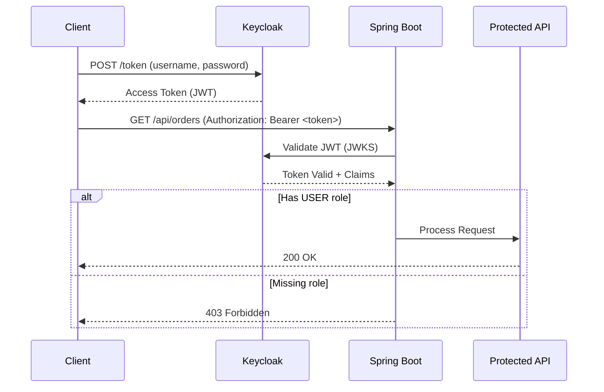
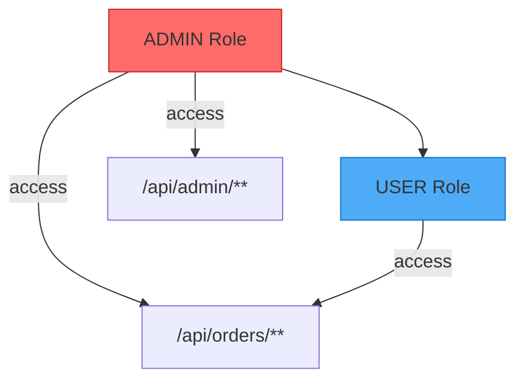

# S6 Security Scenario - OAuth2/OIDC + Vault Integration

This scenario demonstrates integration testing with Keycloak for OAuth2/OIDC authentication and HashiCorp Vault for secrets management using Testcontainers.

## Overview

The S6 Security scenario covers:
- **OAuth2 Resource Server** with JWT validation
- **Role-Based Access Control (RBAC)** with Keycloak
- **Dynamic Credentials** from HashiCorp Vault
- **Secret Rotation** testing

## Components

### Main Application

| File | Description |
|------|-------------|
| `S6Application.java` | Spring Boot application with OAuth2 Resource Server |
| `SecurityConfig.java` | OAuth2/JWT security configuration with Keycloak role extraction |
| `SecuredOrderController.java` | Order endpoint requiring USER role |
| `AdminController.java` | Admin endpoint requiring ADMIN role |

### Configuration

| File | Description |
|------|-------------|
| `application.yml` | Spring Boot configuration with OAuth2 settings |
| `keycloak/realm-export.json` | Keycloak realm with users, roles, and clients |

### Tests

| File | Description |
|------|-------------|
| `S6TestApplication.java` | Test configuration with Keycloak container |
| `KeycloakAuthIT.java` | OAuth2/OIDC authentication tests |
| `VaultCredentialIT.java` | Vault secrets management tests |

## Keycloak Realm Configuration

### Realm: `testcontainers-poc`

### Client: `tc-client`
- Public client with direct access grants enabled
- Used for password grant authentication

### Users

| Username | Password | Roles |
|----------|----------|-------|
| admin | admin123 | ADMIN, USER |
| user | user123 | USER |
| nouser | nouser123 | (none) |

### Roles

- **ADMIN**: Full access to all endpoints including admin operations
- **USER**: Access to order-related endpoints

## API Endpoints

### Secured Order Endpoints (requires USER role)

```
POST /api/orders          - Create a new order
GET  /api/orders          - List user's orders
GET  /api/orders/{id}     - Get order by ID
GET  /api/orders/me       - Get current user info
```

### Admin Endpoints (requires ADMIN role)

```
GET    /api/admin/users       - List all users
POST   /api/admin/users       - Create a user
DELETE /api/admin/users/{id}  - Delete a user
GET    /api/admin/audit-logs  - Get audit logs
GET    /api/admin/stats       - Get system statistics
```

### Public Endpoints

```
GET /actuator/health - Health check endpoint
```

## Test Scenarios

### Authentication Tests
- Successful login returns access token
- Token validation with JWT
- Reject requests without token
- Reject requests with invalid token

### Authorization Tests
- Admin can access admin endpoints
- Admin can access user endpoints (role hierarchy)
- User cannot access admin endpoints (403 Forbidden)
- User can access user endpoints

### Token Tests
- Token refresh works correctly
- Multiple tokens can be generated

### Vault Tests
- Secret storage and retrieval
- Dynamic credential generation
- Secret rotation simulation
- Secret versioning
- Policy management

## Running Tests

```bash
# Run all S6 tests
./gradlew :scenario-s6-security:test

# Run specific test class
./gradlew :scenario-s6-security:test --tests "KeycloakAuthIT"
./gradlew :scenario-s6-security:test --tests "VaultCredentialIT"
```

## Dependencies

- Spring Boot OAuth2 Resource Server
- Spring Cloud Vault (optional)
- Keycloak Admin Client
- Testcontainers Vault

## Architecture


### OAuth2 認證流程



### 角色階層



## Security Best Practices Demonstrated

1. **Stateless JWT Authentication** - No server-side session storage
2. **Role-Based Access Control** - Fine-grained permissions
3. **Token Validation** - Cryptographic verification of JWT signatures
4. **Audit Logging** - Track admin operations
5. **Dynamic Secrets** - Vault-managed credentials
6. **Secret Rotation** - Version-controlled secret updates

## Common Issues

### Keycloak Container Startup
The Keycloak container takes time to start and import the realm. The test configuration waits for the `/health/ready` endpoint before proceeding.

### Token Expiration
Access tokens expire after 5 minutes (300 seconds). Ensure tests complete within this window or refresh tokens as needed.

### Role Extraction
Keycloak stores roles in `realm_access.roles` claim. The `SecurityConfig` extracts these roles and maps them to Spring Security authorities with the `ROLE_` prefix.
