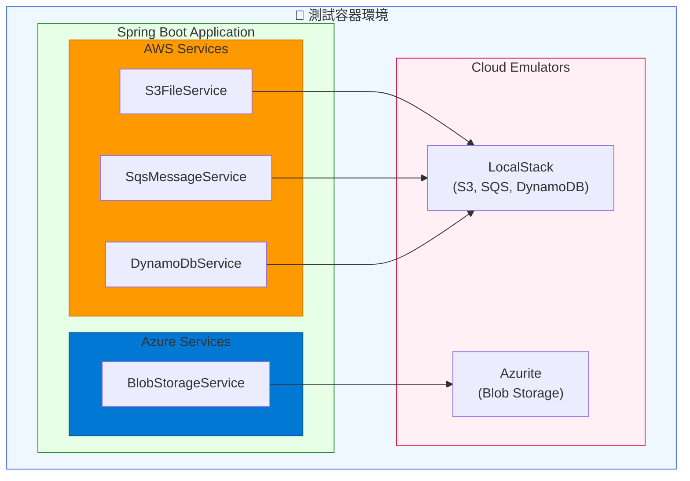

# Scenario S7: 雲端服務整合測試

## 學習目標

完成本場景後，您將學會：
- 使用 LocalStack 測試 AWS 服務（S3、SQS、DynamoDB）
- 使用 Azurite 測試 Azure Blob Storage
- 實作雲端服務的本地整合測試
- 使用條件化 Bean 配置處理多雲端環境
- 避免雲端測試的成本和相依性問題

## 環境需求

- Java 21+
- Docker Desktop
- Gradle 8.x

## 概述

雲端服務整合測試面臨以下挑戰：
- **成本問題** - 生產雲端服務產生測試費用
- **網路延遲** - 遠端服務影響測試效能
- **可用性** - 外部服務可能影響 CI/CD
- **憑證管理** - 測試環境的憑證管理複雜

本場景使用容器化模擬器解決這些問題，提供 API 相容的本地雲端服務。

## 技術元件

| 元件 | 容器映像 | 模擬服務 |
|------|----------|----------|
| LocalStack | localstack/localstack:3.4 | AWS S3, SQS, DynamoDB |
| Azurite | mcr.microsoft.com/azure-storage/azurite:3.30.0 | Azure Blob Storage |

## 核心概念

### 1. LocalStack AWS 模擬

LocalStack 提供 AWS API 相容的本地服務：

```java
LocalStackContainer localStack = new LocalStackContainer(
    DockerImageName.parse("localstack/localstack:3.4"))
    .withServices(LocalStackContainer.Service.S3,
                  LocalStackContainer.Service.SQS,
                  LocalStackContainer.Service.DYNAMODB);
```

### 2. Azurite Azure 模擬

Azurite 提供 Azure Storage API 相容的本地服務：

```java
GenericContainer<?> azurite = new GenericContainer<>(
    DockerImageName.parse("mcr.microsoft.com/azure-storage/azurite:3.30.0"))
    .withExposedPorts(10000, 10001, 10002)  // Blob, Queue, Table
    .withCommand("azurite", "--blobHost", "0.0.0.0", "--skipApiVersionCheck");
```

### 3. 條件化配置

使用 `@ConditionalOnExpression` 避免 Bean 衝突：

```java
@Configuration
@ConditionalOnExpression("!'${azure.storage.connection-string:}'.isBlank()")
public class AzureConfig {
    // 只在有配置 connection string 時啟用
}
```

## 教學步驟

### 步驟 1：理解專案結構

```
scenario-s7-cloud/
├── src/main/java/com/example/s7/
│   ├── S7Application.java
│   ├── config/
│   │   ├── AwsConfig.java            # AWS SDK 配置
│   │   └── AzureConfig.java          # Azure SDK 配置（條件化）
│   ├── aws/
│   │   ├── S3FileService.java        # S3 檔案操作
│   │   ├── SqsMessageService.java    # SQS 訊息操作
│   │   └── DynamoDbService.java      # DynamoDB 資料操作
│   └── azure/
│       └── BlobStorageService.java   # Azure Blob 操作
├── src/main/resources/
│   └── application.yml
└── src/test/java/com/example/s7/
    ├── LocalStackS3IT.java           # S3 測試
    ├── LocalStackSqsIT.java          # SQS 測試
    ├── LocalStackDynamoDbIT.java     # DynamoDB 測試
    └── AzuriteBlobIT.java            # Azure Blob 測試
```

### 步驟 2：執行測試

```bash
# 執行所有 S7 測試
./gradlew :scenario-s7-cloud:test

# 執行特定測試類別
./gradlew :scenario-s7-cloud:test --tests "LocalStackS3IT"
./gradlew :scenario-s7-cloud:test --tests "LocalStackSqsIT"
./gradlew :scenario-s7-cloud:test --tests "LocalStackDynamoDbIT"
./gradlew :scenario-s7-cloud:test --tests "AzuriteBlobIT"
```

### 步驟 3：觀察雲端服務操作

1. **S3**: 上傳、下載、列出、刪除檔案
2. **SQS**: 發送、接收、確認訊息
3. **DynamoDB**: CRUD 操作、GSI 查詢
4. **Azure Blob**: 上傳、下載、列出、刪除 Blob

## 系統架構



## 測試類別說明

### LocalStackS3IT - S3 檔案測試

| 測試案例 | 說明 |
|----------|------|
| `shouldUploadAndDownloadFile` | 上傳下載檔案 |
| `shouldUploadAndDownloadJsonFile` | JSON 檔案處理 |
| `shouldDeleteExistingFile` | 刪除檔案 |
| `shouldListAllObjectsInBucket` | 列出所有物件 |
| `shouldListObjectsWithPrefix` | 前綴過濾 |
| `shouldCheckIfObjectExists` | 檢查物件存在 |
| `shouldHandleLargeFile` | 大檔案處理 |
| `shouldHandleSpecialCharactersInKey` | 特殊字元處理 |

### LocalStackSqsIT - SQS 訊息測試

| 測試案例 | 說明 |
|----------|------|
| `shouldSendAndReceiveMessage` | 發送接收訊息 |
| `shouldSendAndReceiveJsonMessage` | JSON 訊息 |
| `shouldProcessMessageAndAcknowledge` | 訊息確認 |
| `shouldSendDelayedMessage` | 延遲訊息 |
| `shouldCreateQueueWithDeadLetterQueue` | DLQ 設定 |
| `shouldGetApproximateMessageCount` | 佇列深度 |
| `shouldHandleFifoLikeOrdering` | FIFO 順序 |

### LocalStackDynamoDbIT - DynamoDB 測試

| 測試案例 | 說明 |
|----------|------|
| `shouldCreateTableAndPutItem` | 建表和新增項目 |
| `shouldQueryByPartitionKey` | Partition Key 查詢 |
| `shouldCreateTableWithGsiAndQuery` | GSI 查詢 |
| `shouldUpdateItem` | 更新項目 |
| `shouldDeleteItem` | 刪除項目 |
| `shouldStoreComplexObject` | 複雜物件儲存 |
| `shouldScanAllItems` | 全表掃描 |
| `shouldHandleNumericPrimaryKey` | 數值 Key |

### AzuriteBlobIT - Azure Blob 測試

| 測試案例 | 說明 |
|----------|------|
| `shouldUploadAndDownloadBlob` | 上傳下載 Blob |
| `shouldDeleteExistingBlob` | 刪除 Blob |
| `shouldListAllBlobsInContainer` | 列出 Blobs |
| `shouldCheckIfBlobExists` | 檢查存在 |
| `shouldHandleLargeBlob` | 大 Blob |
| `shouldGetBlobSize` | 取得大小 |
| `shouldCreateContainerIfNotExists` | 容器管理 |

## 程式碼範例

### S3 服務

```java
@Service
public class S3FileService {

    private final S3Client s3Client;

    public void upload(String bucket, String key, byte[] content, String contentType) {
        s3Client.putObject(
            PutObjectRequest.builder()
                .bucket(bucket)
                .key(key)
                .contentType(contentType)
                .build(),
            RequestBody.fromBytes(content)
        );
    }

    public Optional<byte[]> download(String bucket, String key) {
        try {
            ResponseBytes<GetObjectResponse> response = s3Client.getObjectAsBytes(
                GetObjectRequest.builder()
                    .bucket(bucket)
                    .key(key)
                    .build()
            );
            return Optional.of(response.asByteArray());
        } catch (NoSuchKeyException e) {
            return Optional.empty();
        }
    }
}
```

### DynamoDB 查詢（處理保留字）

```java
public List<Map<String, AttributeValue>> queryByGsi(String tableName, String indexName,
                                                     String partitionKeyName,
                                                     AttributeValue partitionKeyValue) {
    // 使用 ExpressionAttributeNames 處理保留字（如 "status"）
    Map<String, String> expressionNames = new HashMap<>();
    expressionNames.put("#pk", partitionKeyName);

    Map<String, AttributeValue> expressionValues = new HashMap<>();
    expressionValues.put(":pk", partitionKeyValue);

    QueryRequest request = QueryRequest.builder()
        .tableName(tableName)
        .indexName(indexName)
        .keyConditionExpression("#pk = :pk")
        .expressionAttributeNames(expressionNames)
        .expressionAttributeValues(expressionValues)
        .build();

    return dynamoDbClient.query(request).items();
}
```

### Azure Blob 服務

```java
@Service
@ConditionalOnBean(BlobServiceClient.class)
public class BlobStorageService {

    private final BlobServiceClient blobServiceClient;

    public void upload(String container, String blobName, byte[] content, String contentType) {
        BlobContainerClient containerClient = blobServiceClient.getBlobContainerClient(container);
        BlobClient blobClient = containerClient.getBlobClient(blobName);

        try (ByteArrayInputStream stream = new ByteArrayInputStream(content)) {
            blobClient.upload(stream, content.length, true);
        }
    }
}
```

### 測試配置

```java
@DynamicPropertySource
static void configureProperties(DynamicPropertyRegistry registry) {
    // LocalStack
    registry.add("aws.endpoint", () -> localStack.getEndpoint().toString());
    registry.add("aws.region", () -> localStack.getRegion());
    registry.add("aws.access-key-id", () -> localStack.getAccessKey());
    registry.add("aws.secret-access-key", () -> localStack.getSecretKey());

    // Azurite
    registry.add("azure.storage.connection-string", () ->
        AzuriteContainerFactory.buildConnectionString(
            azurite.getHost(),
            azurite.getMappedPort(10000)
        ));
}
```

## 常見問題

### Q1: Azurite API 版本不支援
**問題**: Azure SDK 使用的 API 版本 Azurite 不支援
**解決**: 啟動 Azurite 時加入 `--skipApiVersionCheck` 參數

### Q2: DynamoDB 保留字錯誤
**問題**: 查詢時出現 "reserved keyword" 錯誤
**解決**: 使用 `ExpressionAttributeNames` 映射欄位名稱

### Q3: LocalStack 服務未啟動
**問題**: S3/SQS/DynamoDB 服務不可用
**解決**: 確認 `withServices()` 包含所需服務

### Q4: Azure 和 LocalStack 測試互相干擾
**問題**: LocalStack 測試載入 Azure 配置導致失敗
**解決**: 使用 `@ConditionalOnExpression` 條件化 Azure 配置

## 優點

1. **零成本** - 無雲端測試費用
2. **快速** - 本地容器比網路呼叫快
3. **可靠** - 不依賴外部服務可用性
4. **可重現** - 相同容器版本確保一致結果
5. **CI/CD 友善** - 任何有 Docker 的環境都能執行

## 驗收標準

- ✅ S3 檔案操作正確
- ✅ SQS 訊息處理正確
- ✅ DynamoDB CRUD 和查詢正確
- ✅ Azure Blob 操作正確
- ✅ 大檔案處理正確

## 延伸學習

- [S6-Security](../scenario-s6-security/): 安全性測試
- [S8-Contract](../scenario-s8-contract/): 契約測試
- [LocalStack 官方文件](https://docs.localstack.cloud/)
- [Azurite 官方文件](https://learn.microsoft.com/en-us/azure/storage/common/storage-use-azurite)
- [AWS SDK v2](https://docs.aws.amazon.com/sdk-for-java/latest/developer-guide/)
- [Azure Storage Blob SDK](https://learn.microsoft.com/en-us/azure/storage/blobs/storage-quickstart-blobs-java)
