# Scenario S7: Cloud Service Integration Testing

This scenario demonstrates integration testing with cloud service emulators using Testcontainers:
- **LocalStack** for AWS services (S3, SQS, DynamoDB)
- **Azurite** for Azure services (Blob Storage)

## Overview

Cloud service integration tests often face challenges:
- Production cloud services incur costs for testing
- Network latency affects test performance
- External service availability impacts CI/CD reliability
- Credential management for test environments is complex

This scenario solves these problems using containerized emulators that provide API-compatible local versions of cloud services.

## Architecture

```mermaid
flowchart TB
    subgraph Test["🧪 測試容器環境"]
        subgraph App["Spring Boot Application"]
            subgraph AWS["AWS Services"]
                S3S["S3FileService"]
                SQS["SqsMessageService"]
                DDB["DynamoDbService"]
            end
            subgraph Azure["Azure Services"]
                Blob["BlobStorageService"]
            end
        end

        subgraph Containers["Cloud Emulators"]
            LS["LocalStack\n(S3, SQS, DynamoDB)"]
            AZ["Azurite\n(Blob Storage)"]
        end
    end

    S3S --> LS
    SQS --> LS
    DDB --> LS
    Blob --> AZ

    style Test fill:#f0f8ff,stroke:#4169e1
    style App fill:#e6ffe6,stroke:#228b22
    style AWS fill:#ff9900,stroke:#cc7a00
    style Azure fill:#0078d4,stroke:#005a9e
    style Containers fill:#fff0f5,stroke:#dc143c
```



### 雲端服務對照

```mermaid
flowchart LR
    subgraph Prod["🌐 Production"]
        AWSP["AWS Cloud"]
        AzureP["Azure Cloud"]
    end

    subgraph Test["🧪 Testing"]
        LST["LocalStack Container"]
        AZT["Azurite Container"]
    end

    AWSP -.->|"API Compatible"| LST
    AzureP -.->|"API Compatible"| AZT

    style Prod fill:#e8f5e9,stroke:#4caf50
    style Test fill:#fff3e0,stroke:#ff9800
```



## Services

### AWS Services (via LocalStack)

#### S3FileService
- `upload()` - Upload files with content type
- `download()` - Download files
- `delete()` - Delete files
- `listObjects()` - List all objects in bucket
- `listObjectsWithPrefix()` - List objects with prefix filter
- `exists()` - Check if object exists

#### SqsMessageService
- `sendMessage()` - Send message to queue
- `sendMessageWithDelay()` - Send delayed message
- `receiveMessage()` / `receiveMessages()` - Receive messages
- `deleteMessage()` - Delete (acknowledge) message
- `createQueueWithDlq()` - Create queue with dead-letter queue
- `getApproximateMessageCount()` - Get queue depth

#### DynamoDbService
- `createTable()` - Create table with primary key
- `createTableWithGsi()` - Create table with GSI
- `putItem()` - Insert/update item
- `getItem()` - Get item by key
- `deleteItem()` - Delete item
- `queryByPartitionKey()` - Query by partition key
- `queryByGsi()` - Query using GSI
- `scanAll()` - Scan entire table

### Azure Services (via Azurite)

#### BlobStorageService
- `upload()` - Upload blob with content type
- `download()` - Download blob
- `delete()` - Delete blob
- `listBlobs()` - List all blobs in container
- `exists()` - Check if blob exists
- `getBlobSize()` - Get blob size

## Running Tests

```bash
# Run all S7 tests
./gradlew :scenario-s7-cloud:test

# Run specific test class
./gradlew :scenario-s7-cloud:test --tests "LocalStackS3IT"
./gradlew :scenario-s7-cloud:test --tests "LocalStackSqsIT"
./gradlew :scenario-s7-cloud:test --tests "LocalStackDynamoDbIT"
./gradlew :scenario-s7-cloud:test --tests "AzuriteBlobIT"
```

## Configuration

### AWS Configuration (application.yml)

```yaml
aws:
  endpoint: ""           # Empty for real AWS, LocalStack URL for testing
  region: us-east-1
  access-key-id: test
  secret-access-key: test
```

### Azure Configuration (application.yml)

```yaml
azure:
  storage:
    connection-string: ""  # Azure connection string or Azurite connection
```

## Test Configuration

Tests use `@DynamicPropertySource` to inject container endpoints:

```java
@DynamicPropertySource
static void configureProperties(DynamicPropertyRegistry registry) {
    // LocalStack
    registry.add("aws.endpoint", () -> localStack.getEndpoint().toString());

    // Azurite
    registry.add("azure.storage.connection-string", () ->
        AzuriteContainerFactory.buildConnectionString(
            azurite.getHost(),
            azurite.getMappedPort(10000)
        )
    );
}
```

## Container Factories

### LocalStackContainerFactory
- Provides singleton LocalStack container
- Pre-configured for S3, SQS, DynamoDB
- Supports container reuse for faster tests

### AzuriteContainerFactory
- Provides singleton Azurite container
- Pre-configured for Blob, Queue, Table storage
- Includes connection string builder utility

## Key Test Patterns

### S3 Tests
- Upload/download various content types
- Handle non-existent files gracefully
- List and filter objects
- Overwrite existing files
- Large file handling

### SQS Tests
- Send/receive messages
- Message acknowledgment (delete)
- Delayed messages
- Dead-letter queue setup
- Queue depth monitoring

### DynamoDB Tests
- CRUD operations
- Complex attribute types (maps, sets)
- GSI queries
- Table existence checks
- Numeric vs string keys

### Azure Blob Tests
- Upload/download blobs
- Container management
- Blob existence checks
- Nested paths (virtual folders)

## Benefits

1. **Cost-Effective**: No cloud charges for test execution
2. **Fast**: Local containers are faster than network calls to cloud
3. **Reliable**: No dependency on external service availability
4. **Reproducible**: Same container version ensures consistent results
5. **CI/CD Friendly**: Works in any environment with Docker

## Dependencies

```kotlin
// AWS SDK v2
implementation(platform("software.amazon.awssdk:bom:2.x.x"))
implementation("software.amazon.awssdk:s3")
implementation("software.amazon.awssdk:sqs")
implementation("software.amazon.awssdk:dynamodb")

// Azure Storage
implementation("com.azure:azure-storage-blob:12.x.x")

// Testcontainers
testImplementation("org.testcontainers:localstack")
testImplementation(project(":tc-common"))
```
