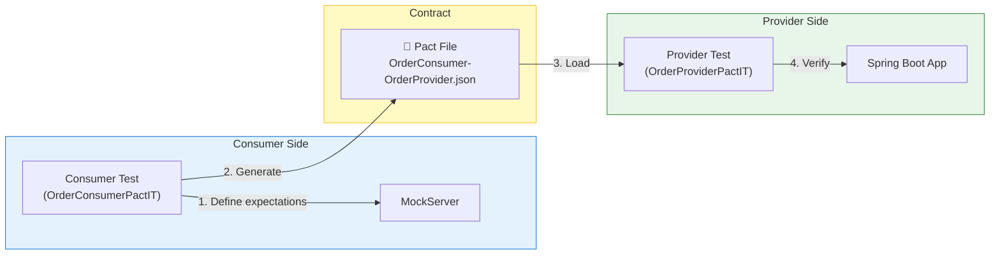
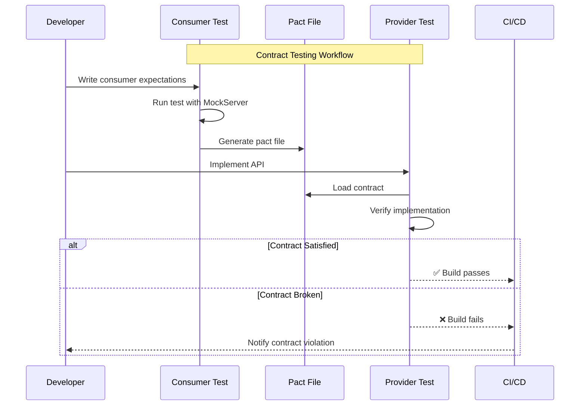

# Scenario S8: 契約測試 (Contract Testing with Pact)

## 學習目標

完成本場景後，您將學會：
- 理解消費者驅動契約測試（Consumer-Driven Contract Testing）
- 使用 Pact 定義 API 契約
- 實作 Consumer 測試生成 Pact 檔案
- 實作 Provider 測試驗證契約
- 使用 State Handlers 設定測試狀態

## 環境需求

- Java 21+
- Docker Desktop（可選，本場景不需要容器）
- Gradle 8.x

## 概述

契約測試是一種確保服務間通訊正確的測試方法：
- **Consumer** 定義其對 Provider API 的期望
- **Provider** 驗證其實作滿足這些期望
- **契約** 作為兩者間的協議文件

這種方法特別適合微服務架構，可以獨立測試各服務而不需要完整的整合環境。

## 核心概念

### 1. 契約測試流程



### 2. Consumer-Driven 的好處

- **快速回饋** - 早期發現整合問題
- **獨立測試** - Consumer 和 Provider 可分開測試
- **文件化** - Pact 檔案即 API 文件
- **版本控制** - 契約可追蹤和管理
- **CI/CD 整合** - 易於整合到建置流程

### 3. Pact 工作流程



### 4. Contract Testing vs Design by Contract

雖然名稱相似，但這兩個概念有本質上的不同：

| 面向 | Contract Testing (契約測試) | Design by Contract (契約式設計) |
|------|----------------------------|--------------------------------|
| **提出者** | Pact 社群 / ThoughtWorks | Bertrand Meyer (Eiffel 語言) |
| **目的** | 驗證服務間 API 通訊 | 定義函式/方法的正確性條件 |
| **範圍** | 分散式系統、微服務 | 單一程式內的函式/類別 |
| **驗證時機** | 測試階段 (CI/CD) | 執行階段 (Runtime) |
| **主要元素** | Consumer 期望、Provider 驗證 | 前置條件、後置條件、不變量 |

**Design by Contract (DbC)** 範例：

```java
// DbC 風格：定義函式的契約條件
public class BankAccount {
    private BigDecimal balance;

    /**
     * @pre amount > 0 (前置條件)
     * @pre balance >= amount (前置條件)
     * @post balance == old(balance) - amount (後置條件)
     */
    public void withdraw(BigDecimal amount) {
        assert amount.compareTo(BigDecimal.ZERO) > 0 : "Amount must be positive";
        assert balance.compareTo(amount) >= 0 : "Insufficient balance";

        BigDecimal oldBalance = balance;
        balance = balance.subtract(amount);

        assert balance.equals(oldBalance.subtract(amount)) : "Post-condition violated";
    }
}
```

**Contract Testing** 關注的是：
- 「Consumer 期望 Provider 回傳什麼格式的資料？」
- 「Provider 是否滿足所有 Consumer 的期望？」

**Design by Contract** 關注的是：
- 「呼叫這個方法前，必須滿足什麼條件？」
- 「方法執行後，保證會達成什麼狀態？」

兩者可以互補：在微服務架構中使用 Contract Testing 確保服務間通訊，在各服務內部使用 DbC 原則確保程式邏輯正確。

## 教學步驟

### 步驟 1：理解專案結構

```
scenario-s8-contract/
├── src/main/java/com/example/s8/
│   ├── S8Application.java
│   ├── controller/
│   │   └── OrderController.java      # REST API
│   ├── domain/
│   │   └── Order.java                # 訂單實體
│   └── service/
│       └── OrderService.java         # 訂單服務
├── src/main/resources/
│   └── application.yml
└── src/test/java/com/example/s8/
    ├── OrderConsumerPactIT.java      # Consumer 契約測試（生成 Pact）
    └── OrderProviderPactIT.java      # Provider 契約測試（驗證 Pact）
```

### 步驟 2：執行 Consumer 測試（生成 Pact）

```bash
# 先執行 Consumer 測試生成 Pact 檔案
./gradlew :scenario-s8-contract:test --tests "*OrderConsumerPactIT"
```

Pact 檔案生成於：`build/pacts/OrderConsumer-OrderProvider.json`

### 步驟 3：執行 Provider 測試（驗證 Pact）

```bash
# 執行 Provider 測試驗證實作
./gradlew :scenario-s8-contract:test --tests "*OrderProviderPactIT"
```

### 步驟 4：執行所有測試

```bash
# 完整執行（Consumer 必須先於 Provider）
./gradlew :scenario-s8-contract:test
```

## 契約規格

### GET /api/orders/{id}

取得訂單詳情。

**成功回應 (200 OK):**
```json
{
  "id": "550e8400-e29b-41d4-a716-446655440000",
  "customerName": "John Doe",
  "status": "PENDING"
}
```

**找不到 (404 Not Found):** 訂單不存在時。

### POST /api/orders

建立新訂單。

**請求:**
```json
{
  "customerName": "John Doe"
}
```

**成功回應 (201 Created):**
```json
{
  "id": "generated-uuid",
  "customerName": "John Doe",
  "status": "PENDING"
}
```

## 程式碼範例

### Consumer 測試

```java
@ExtendWith(PactConsumerTestExt.class)
@PactTestFor(providerName = "OrderProvider")
class OrderConsumerPactIT {

    // 定義期望的互動
    @Pact(consumer = "OrderConsumer")
    public V4Pact getOrderByIdPact(PactDslWithProvider builder) {
        return builder
            .given("an order with ID 550e8400-e29b-41d4-a716-446655440000 exists")
            .uponReceiving("a request to get an order by ID")
                .path("/api/orders/550e8400-e29b-41d4-a716-446655440000")
                .method("GET")
            .willRespondWith()
                .status(200)
                .body(new PactDslJsonBody()
                    .stringType("id", "550e8400-e29b-41d4-a716-446655440000")
                    .stringType("customerName", "John Doe")
                    .stringType("status", "PENDING"))
            .toPact(V4Pact.class);
    }

    @Test
    @PactTestFor(pactMethod = "getOrderByIdPact")
    void shouldGetOrderById(MockServer mockServer) {
        // Given
        RestTemplate restTemplate = new RestTemplate();

        // When
        ResponseEntity<Order> response = restTemplate.getForEntity(
            mockServer.getUrl() + "/api/orders/550e8400-e29b-41d4-a716-446655440000",
            Order.class
        );

        // Then
        assertThat(response.getStatusCode()).isEqualTo(HttpStatus.OK);
        assertThat(response.getBody().getCustomerName()).isEqualTo("John Doe");
    }
}
```

### Provider 測試

```java
@SpringBootTest(webEnvironment = SpringBootTest.WebEnvironment.RANDOM_PORT)
@Provider("OrderProvider")
@PactFolder("build/pacts")
class OrderProviderPactIT {

    @Autowired
    private OrderService orderService;

    @LocalServerPort
    private int port;

    @BeforeEach
    void setUp(PactVerificationContext context) {
        context.setTarget(new HttpTestTarget("localhost", port));
    }

    @TestTemplate
    @ExtendWith(PactVerificationInvocationContextProvider.class)
    void verifyPact(PactVerificationContext context) {
        context.verifyInteraction();
    }

    // State Handler - 設定測試狀態
    @State("an order with ID 550e8400-e29b-41d4-a716-446655440000 exists")
    void setupOrderExists() {
        UUID orderId = UUID.fromString("550e8400-e29b-41d4-a716-446655440000");
        Order order = new Order(orderId, "John Doe", "PENDING");
        orderService.save(order);
    }

    @State("no order exists")
    void setupNoOrder() {
        orderService.clear();
    }
}
```

## Pact 檔案結構

```json
{
  "consumer": { "name": "OrderConsumer" },
  "provider": { "name": "OrderProvider" },
  "interactions": [
    {
      "description": "a request to get an order by ID",
      "providerStates": [
        { "name": "an order with ID xxx exists" }
      ],
      "request": {
        "method": "GET",
        "path": "/api/orders/550e8400-e29b-41d4-a716-446655440000"
      },
      "response": {
        "status": 200,
        "headers": { "Content-Type": "application/json" },
        "body": {
          "id": "550e8400-e29b-41d4-a716-446655440000",
          "customerName": "John Doe",
          "status": "PENDING"
        }
      }
    }
  ],
  "metadata": {
    "pactSpecification": { "version": "4.0" }
  }
}
```

## 測試類別說明

### OrderConsumerPactIT - Consumer 契約測試

| 測試案例 | 說明 |
|----------|------|
| `getOrderByIdPact` | 定義取得訂單的期望 |
| `createOrderPact` | 定義建立訂單的期望 |
| `getOrderNotFoundPact` | 定義 404 回應的期望 |
| `shouldGetOrderById` | 驗證 Mock 回應正確 |
| `shouldCreateOrder` | 驗證建立流程 |

### OrderProviderPactIT - Provider 契約測試

| State Handler | 說明 |
|---------------|------|
| `setupOrderExists` | 設定訂單存在的狀態 |
| `setupNoOrder` | 設定無訂單的狀態 |
| `verifyPact` | 驗證所有契約互動 |

## 常見問題

### Q1: Pact 檔案未生成
**問題**: Consumer 測試執行後無 Pact 檔案
**解決**: 確認 `@ExtendWith(PactConsumerTestExt.class)` 已加入

### Q2: Provider 驗證失敗
**問題**: Provider 測試找不到 Pact 檔案
**解決**: 確認 `@PactFolder` 路徑正確，且 Consumer 測試已先執行

### Q3: State Handler 未執行
**問題**: Provider 測試未設定預期狀態
**解決**: 確認 `@State` 名稱與 Pact 中的 `providerStates.name` 完全一致

### Q4: 欄位匹配失敗
**問題**: 回應欄位不符合契約
**解決**: 使用 `stringType()` 等 matcher 允許型別匹配而非精確值匹配

## 進階主題

### 使用 Pact Broker

在團隊協作中，可使用 Pact Broker 集中管理契約：

```java
@PactBroker(
    host = "pact-broker.example.com",
    authentication = @PactBrokerAuth(token = "${PACT_BROKER_TOKEN}")
)
class OrderProviderPactIT { ... }
```

### Webhook 整合

Pact Broker 可在契約變更時觸發 Provider 驗證：

1. Consumer 發佈新契約
2. Broker 通知 Provider CI/CD
3. Provider 自動執行驗證
4. 結果回報給 Broker

## 驗收標準

- ✅ Consumer 測試生成有效 Pact 檔案
- ✅ Provider 測試成功驗證契約
- ✅ State Handlers 正確設定測試狀態
- ✅ 契約涵蓋成功和錯誤場景
- ✅ 測試可重複執行

## 延伸學習

- [S1-Core](../scenario-s1-core/): 基礎整合測試
- [Pact 官方文件](https://docs.pact.io/)
- [Pact JVM](https://github.com/pact-foundation/pact-jvm)
- [Consumer-Driven Contracts](https://martinfowler.com/articles/consumerDrivenContracts.html)
- [Pact Broker](https://docs.pact.io/pact_broker)
