```mermaid
sequenceDiagram
    participant Dev as Developer
    participant Consumer as Consumer Test
    participant Pact as Pact File
    participant Provider as Provider Test
    participant CI as CI/CD

    Note over Consumer,Provider: Contract Testing Workflow

    Dev->>Consumer: Write consumer expectations
    Consumer->>Consumer: Run test with MockServer
    Consumer->>Pact: Generate pact file

    Dev->>Provider: Implement API
    Provider->>Pact: Load contract
    Provider->>Provider: Verify implementation

    alt Contract Satisfied
        Provider-->>CI: ✅ Build passes
    else Contract Broken
        Provider-->>CI: ❌ Build fails
        CI-->>Dev: Notify contract violation
    end
```

# S8 - Contract Testing with Pact

This scenario demonstrates **Consumer-Driven Contract Testing** using Pact 4.6.x with JUnit 5.

## Overview

Contract testing ensures that services can communicate correctly by verifying that:
1. **Consumers** document their expectations in a contract (Pact file)
2. **Providers** implement APIs that satisfy those expectations

## Architecture

```mermaid
flowchart LR
    subgraph Consumer["Consumer Side"]
        CT["Consumer Test\n(OrderConsumerPactIT)"]
        MS["MockServer"]
    end

    subgraph Contract["Contract"]
        Pact["📄 Pact File\nOrderConsumer-OrderProvider.json"]
    end

    subgraph Provider["Provider Side"]
        PT["Provider Test\n(OrderProviderPactIT)"]
        SB["Spring Boot App"]
    end

    CT -->|"1. Define expectations"| MS
    CT -->|"2. Generate"| Pact
    Pact -->|"3. Load"| PT
    PT -->|"4. Verify"| SB

    style Consumer fill:#e3f2fd,stroke:#1976d2
    style Contract fill:#fff9c4,stroke:#fbc02d
    style Provider fill:#e8f5e9,stroke:#388e3c
```



### 契約測試流程



## Contract Specification

### GET /api/orders/{id}

Returns an order by ID.

**Response (200 OK):**
```json
{
  "id": "550e8400-e29b-41d4-a716-446655440000",
  "customerName": "John Doe",
  "status": "PENDING"
}
```

**Response (404 Not Found):** When order does not exist.

### POST /api/orders

Creates a new order.

**Request:**
```json
{
  "customerName": "John Doe"
}
```

**Response (201 Created):**
```json
{
  "id": "generated-uuid",
  "customerName": "John Doe",
  "status": "PENDING"
}
```

## Test Files

| File | Description |
|------|-------------|
| `OrderConsumerPactIT.java` | Consumer test that generates the Pact file |
| `OrderProviderPactIT.java` | Provider test that verifies the contract |

## Running Tests

### 1. Generate Pact File (Consumer Test)

Run the consumer test to generate the Pact file:

```bash
./gradlew :scenario-s8-contract:test --tests "*OrderConsumerPactIT"
```

The Pact file is generated at: `build/pacts/OrderConsumer-OrderProvider.json`

### 2. Verify Contract (Provider Test)

Run the provider test to verify the implementation:

```bash
./gradlew :scenario-s8-contract:test --tests "*OrderProviderPactIT"
```

### 3. Run All Tests

```bash
./gradlew :scenario-s8-contract:test
```

**Note:** Consumer tests must run before provider tests to generate the Pact file.

## Key Concepts

### Consumer Test (`OrderConsumerPactIT`)

- Uses `@ExtendWith(PactConsumerTestExt.class)` for Pact JUnit 5 support
- `@Pact` methods define expected interactions
- `@PactTestFor` links tests to specific Pact definitions
- `MockServer` simulates the provider during consumer tests

### Provider Test (`OrderProviderPactIT`)

- Uses `@SpringBootTest` with `RANDOM_PORT` for embedded server
- `@Provider` identifies the provider name (must match consumer's expectation)
- `@PactFolder` points to the generated Pact files
- `@State` methods set up test data for each interaction state

### State Handlers

Provider states allow the provider to set up specific test scenarios:

```java
@State("an order with ID xxx exists")
void setupOrderExists() {
    // Add the expected order to the service
}
```

## Pact File Structure

Generated Pact files follow this structure:

```json
{
  "consumer": { "name": "OrderConsumer" },
  "provider": { "name": "OrderProvider" },
  "interactions": [
    {
      "description": "a request to get an order by ID",
      "providerStates": [
        { "name": "an order with ID xxx exists" }
      ],
      "request": {
        "method": "GET",
        "path": "/api/orders/xxx"
      },
      "response": {
        "status": 200,
        "body": { "id": "...", "customerName": "...", "status": "..." }
      }
    }
  ]
}
```

## Benefits of Contract Testing

1. **Fast Feedback** - Detect integration issues early without deploying
2. **Independent Testing** - Consumer and provider can be tested separately
3. **Documentation** - Pact files serve as API documentation
4. **Version Control** - Contracts can be versioned and tracked
5. **CI/CD Integration** - Easily integrate into build pipelines

## Dependencies

- `au.com.dius.pact.consumer:junit5:4.6.x` - Consumer Pact testing
- `au.com.dius.pact.provider:junit5:4.6.x` - Provider Pact testing
- Spring Boot 3.4.x with embedded web server

## Next Steps

- Integrate with a Pact Broker for contract sharing
- Add more complex contract scenarios (headers, query parameters)
- Implement versioning strategy for contracts
